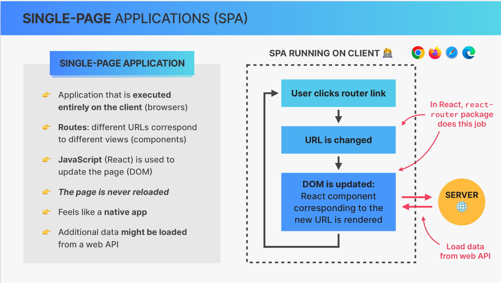

## ReactJS

- [What is React](#1)
- [Components](#2)
- [JSX](#3)
- [Props](#4)
  - [Rendering List](#5)
  - [Conditional Rendering With &&](#6)
  - [Conditional Rendering With Ternaries](#7)
  - [Conditional Rendering With Multiple Returns](#8)
- [State](#9)
  - [useState examples with buttons](#10)
  - [useState examples with form and selector](#11)
  - [useState examples with delete item and clear list](#12)
  - [useState example with checkbox](#13)
  - [useState example with sorting items](#14)
  - [useState example with open/close button](#20)
- [State management](#15)
  - [useState example with derived state ](#16)
- [Children prop](#17)
- [Split a UI into components](#18)
- [Component composition](#19)
- [Styling variants](#21)
- [Styling options for React application](#211)
- [Props as a Component API. PropTypes.](#22)
- [Components, Instances, and Elements](#23)
- [Rendering](#24)
- [Key Prop](#25)
- [State Batching](#26)
- [Events](#27)
- [Practical implication](#28)
- [Effects and Data Fetching](#29)
  - [useEffect example with keypress](#30)
  - [useEffect example with data fetching with async 1](#31)
  - [useEffect example with data fetching with async 2](#311)
  - [useEffect example with data fetching with useReducer](#40)
  - [useEffect example with timer](#41)
  - [useEffect example with local storage](#33)
  - [useEffect example with dark mode](#49)
- [useRef](#32)
  - [useRef example with focus on the input](#34)
  - [useRef example with variable persisted across renders ](#35)
- [Custom hooks](#36)
  - [useLocalStorageState as example of custom hook](#37)
- [useReducer](#39)
  - [useReducer example with bank account](#42)
- [React Router](#43)
  - [React Router example & index route & Outlet element](#44)
  - [React Router example with storing state in the URL & reading a Query String](#45)
  - [React Router example with Navigation](#46)
- [Context API](#47)
  - [Context API example](#48)
  - [Context API example with useReducer](#50)
  - [Context API example with protected route](#51)
- [Redux]()
- [React Query]()

---

### 📒 What is React <a name="1"></a>

`React` – extremely popular declarative, component-based, state-driven JavaScript library for building user interfaces, created by Facebook.

- Based on components. Components are the building blocks of user interfaces in React. We build complex UIs by building and combining multiple components.
- Declarative. We describe how components look like and how they work using a declarative syntax called JSX. `JSX` a syntax that combines HTML, CSS, JavaScript, as well as referencing other components.
- State-driven. React reacts to state changes by re-rendering the UI.

There are several options and freamworks to work with React (Vite, Next.js, Remix, etc.)


---

### 📒 Components <a name="2"></a>

React applications are entirely made out of components. We build complex UIs by building multiple components and combining them. Components can be reused, nested inside each other, and pass data between them.


---

### 📒 JSX <a name="3"></a>

Components must return a block of JSX. `Extension of JavaScript` that allows us to
embed JavaScript, CSS, and React components into HTML. Each JSX element is converted to a `React.createElement` function call.


---

### 📒 Props <a name="4"></a>

`Props` like a chain or communication chanel between a parent and a child components. Props are used to pass data from parent components to child components (down the component tree). With props, parent components control how child components look and work. This one-way date flow makes applications more predictable and easier to understand, easier to debug. Anything can be passed as props: single value, arrays, objects, functions, even other components.
So, props is data coming from the outside, and can only be updated by the parent component. Props are read-only, they are immutable! This is one of React’s strict rules. If you need to mutate props, you actually need state.

---

#### 🚩 Rendering List <a name="5"></a>

For rendering usualy used `.map` which allows to loop through array and create a brand new array.

Example - [Udemy-pizza-menu](https://github.com/agpavlik/Udemy-pizza-menu)

```javascript
const pizzaData = [
  {
    name: "Focaccia",
    ingredients: "Bread with italian olive oil and rosemary",
    price: 6,
    photoName: "pizzas/focaccia.jpg",
    soldOut: false,
  },
  {
    name: "Pizza Margherita",
    ingredients: "Tomato and mozarella",
    price: 10,
    photoName: "pizzas/margherita.jpg",
    soldOut: false,
  },
  {
    name: "Pizza Spinaci",
    ingredients: "Tomato, mozarella, spinach, and ricotta cheese",
    price: 12,
    photoName: "pizzas/spinaci.jpg",
    soldOut: true,
  },
];

function Menu() {
  const pizzas = pizzaData;
  const numPizzas = pizzas.length;

  return (
    <main className="menu">
      <h2>Our menu</h2>
      <ul className="pizzas">
        {pizzaData.map((pizza) => (
          <Pizza pizzaObj={pizza} key={pizza.name} />
        ))}
      </ul>
    </main>
  );
}

function Pizza(props) {
  return (
    <li className={`pizza ${props.pizzaObj.soldOut ? "sold-out" : ""}`}>
      
      <div>
        <h3>{props.pizzaObj.name}</h3>
        <p>{props.pizzaObj.ingredients}</p>

        <span>
          {props.pizzaObj.soldOut ? "SOLD OUT" : props.pizzaObj.price}
        </span>
      </div>
    </li>
  );
}
```

---

#### 🚩 Conditional Rendering With && <a name="6"></a>

```javascript
function Footer() {
  const hour = new Date().getHours();
  const openHour = 12;
  const closeHour = 22;
  const isOpen = hour >= openHour && hour <= closeHour;

  return (
    <footer className="footer">
      {isOpen && (
        <div className="order">
          <p>
            We're open from {props.openHour}:00 to {props.closeHour}:00. Come
            visit us or order online
          </p>
          <button className="btn">Order</button>
        </div>
      )}
    </footer>
  );
}
```

---

#### 🚩 Conditional Rendering With Ternaries <a name="7"></a>

```javascript
function Footer() {
  const hour = new Date().getHours();
  const openHour = 12;
  const closeHour = 22;
  const isOpen = hour >= openHour && hour <= closeHour;

  return (
    <footer className="footer">
      {isOpen ? (
        <div className="order">
          <p>
            We're open from {props.openHour}:00 to {props.closeHour}:00. Come
            visit us or order online
          </p>
          <button className="btn">Order</button>
        </div>
      ) : (
        <p>
          We're happy welcome you between {openHour}:00 and {closeHour}:00.
        </p>
      )}
    </footer>
  );
}
```

Also, ternary operator can be used to conditionaly set some style.<br>
Example: `<span style={item.packed ? {textDecoration:"line-trough"}: {} }>`

---

#### 🚩 Conditional Rendering With Multiple Returns <a name="8"></a>

```javascript
function Footer() {
  const hour = new Date().getHours();
  const openHour = 12;
  const closeHour = 22;
  const isOpen = hour >= openHour && hour <= closeHour;

  if (!isOpen) {
    return (
      <footer className="footer">
        <p>CLOSED</p>
      </footer>
    );
  }

  return (
    <footer className="footer">
      {isOpen ? (
        <div className="order">
          <p>
            We're open from {props.openHour}:00 to {props.closeHour}:00. Come
            visit us or order online
          </p>
          <button className="btn">Order</button>
        </div>
      ) : (
        <p>
          We're happy welcome you between {openHour}:00 and {closeHour}:00.
        </p>
      )}
    </footer>
  );
}
```

---

### 📒 State <a name="9"></a>

`State` is the most important concept in React. `State` is a “component’s memory”.
`State` is internal data that can be updated by the components logic. Data that a component can hold over time, necessary for information that it needs to remember throughout the app’s lifecycle. Updating component state triggers React to re-render the component.
In React, a view is updated by re-rendering the component.

Practical guideline about state:

- Each component has and manages its own state, no matter how many times we render the same component;
- Use a state variable for any data that the component should keep track of ("remember") over time. This is data that will change at some point.
- Whenever you want something in the component to be dynamic,create a piece of state related to that “thing”, and update the state when the “thing” should change.<br>
  Example: A modal window can be open or closed. So we create a state variable 'isOpen' that tracks whether the modal is open or not. On 'isOpen = true' we display the window, on 'isOpen = false' we hide it.
- If you want to change the way a component looks, or the data it displays, update its state. This usually happens in an event handler function.
- When building a component, imagine its view as a reflection of state changing over time.
- For data that should not trigger component re-render, don’t use state. Use a regular variable instead.


`useState` implementation:

- add new state variable
- use state variable in the code
- update piace of state in some event handler function

`Updating State Based on Current State`: Callback function is used to update state based on the current value of this state.

Also, look at example - [useEffect example with local storage](#33)

---

#### 🚩 useState examples with button <a name="10"></a>

Example - [Udemy-step](https://github.com/agpavlik/Udemy-step)

```javascript
import { useState } from "react"; // import useState function from react

const messages = [
  "Learn React ⚛️",
  "Apply for jobs 💼",
  "Invest your new income 🤑",
];

export default function App() {
  const [step, setStep] = useState(1); // add new state variable
  const [isOpen, setIsOpen] = useState(true);

  function handlePrevious() {
    if (step > 1) setStep((s) => s - 1); //update piace of state in event handler function. Callback function is used to update state based on the current value of this state
  }
  function handleNext() {
    if (step < 3) setStep(step + 1); //update piace of state in event handler function
  }

  return (
    <>
      <button
        className="close"
        onClick={() => setIsOpen(!isOpen)} // function created in-line instead of creating handle function out
      >
        &times;
      </button>
      {isOpen && (
        <div className="steps">
          <div className="numbers">
            <div className={step >= 1 ? "active" : ""}>1</div>
            <div className={step >= 2 ? "active" : ""}>2</div>
            <div className={step >= 3 ? "active" : ""}>3</div>
          </div>
          <p className="message">
            Step {step}: {messages[step - 1]}
          </p>
          <div className="buttons">
            <button
              style={{ backgroundColor: "#7950f2", color: "#fff" }}
              onClick={handlePrevious} // event handler
            >
              Previous
            </button>
            <button
              style={{ backgroundColor: "#7950f2", color: "#fff" }}
              onClick={handleNext} // event handler
            >
              Next
            </button>
          </div>
        </div>
      )}
    </>
  );
}
```

Example - [Udemy-flashcards](https://github.com/agpavlik/Udemy-flashcards)

```javascript
const questions = [
  {
    id: 3457,
    question: "What language is React based on?",
    answer: "JavaScript",
  },
  {
    id: 7336,
    question: "What are the building blocks of React apps?",
    answer: "Components",
  },
];

function FlashCards() {
  const [selectedId, setSelectedId] = useState(null);

  function handleClick(id) {
    setSelectedId(id !== selectedId ? id : null);
  }

  return (
    <div className="flashcards">
      {questions.map((question) => (
        <div
          key={question.id}
          onClick={() => handleClick(question.id)}
          className={question.id === selectedId ? "selected" : ""}
        >
          <p>
            {question.id === selectedId ? question.answer : question.question}
          </p>
        </div>
      ))}
    </div>
  );
}
```

---

#### 🚩 useState examples with form and selector <a name="11"></a>

Example - [Udemy-far-away](https://github.com/agpavlik/Udemy-far-away)

```javascript
import { useState } from "react";

export default function Form() {
  const [description, setDescription] = useState("");
  const [quantity, setQuantity] = useState(1);
  const [items, setItems] = useState([]);

  function handleAddItems(item) {
    setItems((items) => [...items, item]); //add a new item into existing array
  }

  function handleSubmit(e) {
    e.preventDefault(); // Page not to reload. thia disavbled its default behaviour of HTML.
    if (!description) return; // we should been able to submit the form without description

    const newItem = {
      description,
      quantity,
      packed: false,
      id: Date.now(),
    };

    handleAddItems(newItem);

    setDescription(""); //after submition form should back to the initial state
    setQuantity(1); //after submition form should back to the initial state
  }

  // Trick for selector. Create an empty array with 20 elements. Than pass a function with two elements (value and index) and will receive an array with numbers from 1 to 20. Than loop with map method over this array to create a list of elements.

  // e.target.value is always a string, therefore we use Number to convert it to number.
  return (
    <form className="add-form" onSubmit={handleSubmit}>
      <h3>What do you need for your trip?</h3>
      <select
        value={quantity}
        onChange={(e) => setQuantity(Number(e.target.value))}
      >
        {Array.from({ length: 20 }, (_, i) => i + 1).map((num) => (
          <option value={num} key={num}>
            {num}
          </option>
        ))}
      </select>
      <input
        type="text"
        placeholder="Item..."
        value={description}
        onChange={(e) => setDescription(e.target.value)}
      />

      <button>Add</button>
    </form>
  );
}
```

Example - [Udemy-eat-n-split](https://github.com/agpavlik/Udemy-eat-n-split)

```javascript
export default function App() {
  const [friends, setFriends] = useState(initialFriends);

  function handleAddFriend(friend) {
    setFriends((friends) => [...friends, friend]);
    setShowAddFriend(false);
  }

  return (
    <div className="app">
      <FormAddFriend onAddFriend={handleAddFriend} />
    </div>
  );
}

function FormAddFriend({ onAddFriend }) {
  const [name, setName] = useState("");
  const [image, setImage] = useState("https://i.pravatar.cc/48");

  function handleSubmit(e) {
    e.preventDefault();

    if (!name || !image) return;

    const id = crypto.randomUUID();
    const newFriend = { name, image: `${image}?=${id}`, balance: 0, id };
    onAddFriend(newFriend);

    setName("");
    setImage("https://i.pravatar.cc/48");
  }

  return (
    <form className="form-add-friend" onSubmit={handleSubmit}>
      <label> Friend name </label>
      <input
        type="text"
        value={name}
        onChange={(e) => setName(e.target.value)}
      />

      <label> Image URL </label>
      <input
        type="text"
        value={image}
        onChange={(e) => setImage(e.target.value)}
      />

      <Button>Add</Button>
    </form>
  );
}
```

Example - [Udemy-tip-calculator](https://github.com/agpavlik/Udemy-tip-calculator) - input

```javascript
export default function TipCalculator() {
  const [bill, setBill] = useState("");

  return (
    <div>
      <BillInput bill={bill} onSetBill={setBill} />
    </div>
  );
}

function BillInput({ bill, onSetBill }) {
  return (
    <div className="question">
      <label> How much was the bill ?</label>
      <input
        className="input"
        type="text"
        placeholder="Bill value"
        value={bill}
        onChange={(e) => onSetBill(Number(e.target.value))}
      ></input>
    </div>
  );
}
```

Example - [Udemy-tip-calculator](https://github.com/agpavlik/Udemy-tip-calculator) - select

```javascript
export default function TipCalculator() {
  const [bill, setBill] = useState("");
  const [percentage1, setPercentage1] = useState(0);
  const [percentage2, setPercentage2] = useState(0);

  const tip = bill * ((percentage1 + percentage2) / 2 / 100);

  function handleReset() {
    setBill("");
    setPercentage1(0);
    setPercentage2(0);
  }

  return (
    <div>
      <BillInput bill={bill} onSetBill={setBill} />
      <SelectPercentage percentage={percentage1} onSelect={setPercentage1}>
        How did you like the service?
      </SelectPercentage>
      <SelectPercentage percentage={percentage2} onSelect={setPercentage2}>
        How did your friend like the service?
      </SelectPercentage>
    </div>
  );
}

function SelectPercentage({ children, onSelect, percentage }) {
  return (
    <div className="question">
      <label>{children}</label>
      <select
        className="input"
        value={percentage}
        onChange={(e) => onSelect(Number(e.target.value))}
      >
        <option value="0">Dissatisfied (0%) </option>
        <option value="5">It was okay (5%)</option>
        <option value="10">It was good (10%)</option>
        <option value="20">Abssolutely amazing! (20%)</option>
      </select>
    </div>
  );
}
```

---

#### 🚩 useState examples with delete item and clear list<a name="12"></a>

Example - [Udemy-far-away](https://github.com/agpavlik/Udemy-far-away)

```javascript
export default function App() {
  const [items, setItems] = useState([]);

  function handleDeleteItem(id) {
    setItems((items) => items.filter((item) => item.id !== id)); // delete item with the exact id. Filter create a new array without the exact id.
  }

  function handleClearList() {
    const confirmed = window.confirm(
      "Are you sure you want to delete all items?"
    );
    if (confirmed) setItems([]);
  }

  return (
    <div>
      <PackingList
        items={items}
        onDeleteItem={handleDeleteItem}
        onClearList={handleClearList}
      />
    </div>
  );
}

function PackingList({ items, onDeleteItem, onClearList }) {
  return (
    <div className="list">
      <ul>
        {items.map((item) => (
          <Item item={item} key={item.id} onDeleteItem={onDeleteItem} />
        ))}
      </ul>
      <button onClick={onClearList}>Clear list</button>
    </div>
  );
}

// Create a function in onClick in order to receive just an item.id, but not a whole event
function Item({ item, onDeleteItem }) {
  return (
    <li>
      <span style={item.packed ? { textDecoration: "line-through" } : {}}>
        {item.quantity} {item.description}
      </span>
      <button onClick={() => onDeleteItem(item.id)}>❌</button>
    </li>
  );
}
```

Example - [Udemy-tip-calculator](https://github.com/agpavlik/Udemy-tip-calculator) - reset

```javascript
export default function TipCalculator() {
  const [bill, setBill] = useState("");

  function handleReset() {
    setBill("");
    setPercentage1(0);
    setPercentage2(0);
  }

  return (
    <div>
      <BillInput bill={bill} onSetBill={setBill} />
      {bill > 0 && (
        <>
          <Output bill={bill} tip={tip} />
          <Reset onReset={handleReset} />
        </>
      )}
    </div>
  );
}

function Reset({ onReset }) {
  return (
    <button className="btn" onClick={onReset}>
      Reset
    </button>
  );
}
```

---

#### 🚩 useState examples with checkbox <a name="13"></a>

Example - [Udemy-far-away](https://github.com/agpavlik/Udemy-far-away)

```javascript
export default function App() {
  const [items, setItems] = useState([]);

  function handleToggleItem(id) {
    setItems((items) =>
      items.map((item) =>
        item.id === id ? { ...item, packed: !item.packed } : item
      )
    ); // return the same array but with one object updated
  }

  return (
    <div>
      <PackingList items={items} onToggleItem={handleToggleItem} />
    </div>
  );
}

function PackingList({ items, onToggleItem }) {
  return (
    <div className="list">
      <ul>
        {items.map((item) => (
          <Item item={item} key={item.id} onToggleItem={onToggleItem} />
        ))}
      </ul>
    </div>
  );
}

// Create a function in onChange in order to change just one item, but not a whole event
function Item({ item, onToggleItem }) {
  return (
    <li>
      <input
        type="checkbox"
        value={item.packed}
        onChange={() => onToggleItem(item.id)}
      />
      <span style={item.packed ? { textDecoration: "line-through" } : {}}>
        {item.quantity} {item.description}
      </span>
    </li>
  );
}
```

---

#### 🚩 useState examples with sorting items <a name="14"></a>

Example - [Udemy-far-away](https://github.com/agpavlik/Udemy-far-away)

```javascript
export default function PackingList({ items }) {
  const [sortBy, setSortBy] = useState("input"); // by default will be the first value

  let sortedItems;

  if (sortBy === "input") sortedItems = items;
  if (sortBy === "description")
    sortedItems = items
      .slice() //a copy of an array
      .sort((a, b) => a.description.localeCompare(b.description));
  if (sortBy === "packed")
    sortedItems = items
      .slice()
      .sort((a, b) => Number(a.packed) - Number(b.packed));

  return (
    <div className="list">
      <ul>
        {sortedItems.map((item) => (
          <Item item={item} key={item.id} />
        ))}
      </ul>

      <div className="actions">
        <select value={sortBy} onChange={(e) => setSortBy(e.target.value)}>
          <option value="input">Sorts by input order</option>
          <option value="description">Sort by description</option>
          <option value="packed">Sort by packed status</option>
        </select>
      </div>
    </div>
  );
}
```

---

#### 🚩 useState example with open/close button <a name="20"></a>

Example - [Udemy-use-popcorn](https://github.com/agpavlik/Udemy-use-popcorn)

```javascript
function Box({ children }) {
  const [isOpen, setIsOpen] = useState(true);

  return (
    <div className="box">
      <button className="btn-toggle" onClick={() => setIsOpen((open) => !open)}>
        {isOpen ? "–" : "+"}
      </button>
      {isOpen && children}
    </div>
  );
}
```

---

### 📒 State Management <a name="15"></a>

`State management`: Deciding when to create pieces of state, what types of state are necessary, where to place each piece of state, and how data flows trough app.


`One-way data flow`: Means that data can only be passed from parents to children and never in opposite way. Also, data cannot flow sideways to siblings.

`Lifting state up`: In order to share one piece of state with siblings it should be lifted up to the closest common parent.

`Inverse data flow`: child-to-parent communication when child updating parent state.


`Derived State`: state that is computed from an existing piece of state or form props.


---

#### 🚩 useState examples with derived state <a name="16"></a>

Example - [Udemy-far-away](https://github.com/agpavlik/Udemy-far-away)

```javascript
export default function Stats({ items }) {
  const [items, setItems] = useState([]);

  if (!items.length)
    return (
      <p className="stats">
        <em>Start adding some items to your packing list </em>
      </p>
    );
  const numItems = items.length;
  const numPacked = items.filter((item) => item.packed).length;
  const percentage = Math.round((numPacked / numItems) * 100);

  return (
    <footer className="stats">
      <em>
        {percentage === 100
          ? "You got everything! Ready to go ✈️"
          : `You have ${numItems} items on your list, and you have already packed
        ${numPacked} (${percentage}%)`}
      </em>
    </footer>
  );
}
```

---

### 📒 Children prop <a name="17"></a>

When we include the button component in some JSX, instead of immediately closing the element, we can write some more JSX into that element. We can write anything that we want between the opening and the closing tag of the component that we are using.

Example - [Udemy-step](https://github.com/agpavlik/Udemy-step)

```javascript
import { useState } from "react";

const messages = [
  "Learn React ⚛️",
  "Apply for jobs 💼",
  "Invest your new income 🤑",
];

export default function App() {
  const [step, setStep] = useState(1);
  const [isOpen, setIsOpen] = useState(true);

  function handlePrevious() {
    if (step > 1) setStep((s) => s - 1);
  }
  function handleNext() {
    if (step < 3) setStep(step + 1);
  }

  return (
    <>
      <button className="close" onClick={() => setIsOpen(!isOpen)}>
        &times;
      </button>
      {isOpen && (
        <div className="steps">
          <div className="numbers">
            <div className={step >= 1 ? "active" : ""}>1</div>
            <div className={step >= 2 ? "active" : ""}>2</div>
            <div className={step >= 3 ? "active" : ""}>3</div>
          </div>

          <StepMessage step={step}>
            {messages[step - 1]}
            <div className="buttons">
              <Button
                bgColor="#c7c7c7"
                textColor="#333"
                onClick={() => alert(`Learn how to ${messages[step - 1]}`)}
              >
                Lern how
              </Button>
            </div>
          </StepMessage>

          <div className="buttons">
            <Button bgColor="#7950f2" textColor="#fff" onClick={handlePrevious}>
              <span>👈</span> Previous
            </Button>
            <Button bgColor="#7950f2" textColor="#fff" onClick={handleNext}>
              Next <span>👉</span>
            </Button>
          </div>
        </div>
      )}
    </>
  );
}

function StepMessage({ step, children }) {
  return (
    <div className="message">
      <h3>Step {step}</h3>
      {children}
    </div>
  );
}

function Button({ textColor, bgColor, onClick, children }) {
  return (
    <button
      style={{ backgroundColor: bgColor, color: textColor }}
      onClick={onClick}
    >
      {children}
    </button>
  );
}
```

---

### 📒 Split a UI into components<a name="18"></a>


---

### 📒 Component composition<a name="19"></a>

`Component composition`: combining different components using the
children prop (or explicitly defined props)
We use composition for two reasons:

1. Create highly reusable and flexible components
2. Fix prop drilling (great for layouts)


Example - [Udemy-use-popcorn](https://github.com/agpavlik/Udemy-use-popcorn)

Examle with using the children:

```javascript
// before
export default function App() {
  const { movies, setMovies} = useState(tempMovieData);

  return (
    <>
      <NavBar movies={movies} />
      <Main movies={movies} />
  )
}

function NavBar({ movies }) {
  return <nav className="nav-bar">
    <Logo />
    <Search />
    <NumResults movies={movies}>
  </nav>;
}
```

```javascript
// after using component composition
// prop drilling has been eliminated
export default function App() {
  const { movies, setMovies} = useState(tempMovieData);

  return (
    <>
      <NavBar>
        <Logo />
        <Search />
        <NumResults movies={movies}>
      </NavBar>
      <Main movies={movies} />
  )
}

function NavBar({ children }) {
  return <nav className="nav-bar">{children}</nav>;
}
```

Example with using the explicit prop

```javascript
// before
export default function App() {
  return (
    <Main>
      <Box>
        <MovieList movies={movies} />
      </Box>
    </Main>
  );
}

function Box({ children }) {}
```

```javascript
// after using the explicit prop
export default function App() {
  return (
    <Main>
      <Box element={<MovieList movies={movies} />} />
    </Main>
  );
}

function Box({ element }) {} // can be called anything
```

---

### 📒 Styling variants <a name="21"></a>

Variant 1

```javascript
function Header() {
  return (
    <h1
      style={{ color: "red", fontSize: "48px", tetxTransform: "uppercase" }}
    />
  );
}
```

Variant 2

```javascript
function Header() {
  const style = { color: "red", fontSize: "48px", tetxTransform: "uppercase" };
  return <h1 style={style} />;
}
```

---

### 📒 Styling options for React application. <a name="211"></a>

React really doesn't care about how you style your applications.


- CSS modules are pretty similar to regular CSS files with the difference that we write just one CSS file for each of our components. The styles in that file will then be scoped to only that component so that no other component can use them.
- CSS in JavaScript library like styled components. So as the name says with CSS in JavaScript, you actually write your CSS inside a JavaScript file, so in the same file where you define your components. What's special about a CSS in JavaScript library is that it allows us to create React components that have our styles directly apply to them, which we can then use just like regular components. So this fully embraces the React philosophy that a component should contain all the information about its appearance, and so that includes CSS.
- Tailwind use predefined utility classes to define individual styles, to use flexbox, to make layouts responsive, to make hover effects and really to design your entire UI, and all that without ever having to leave the JSX markup.
- One more option here, which is basically to not write any CSS at all. Well, it is actually possible, because you can build your entire project using a fully fledged UI component library, for example, like Material UI, Chakra UI, or Mantine. So essentially, a component library like those contains all kinds of prebuilt and pre-styled components that are common in most web applications.

---

### 📒 Props as a Component API. PropTypes.<a name="22"></a>

Example - [Udemy-use-popcorn](https://github.com/agpavlik/Udemy-use-popcorn)

```javascript
//provide default values for props
export default function StarRating({
  maxRating = 5,
  color = "#c69603",
  size = 34,
  className = "",
  messages = [],
  defaultRating = 0,
  onSetRating,
}) {
  const textStyle = {
    lineHeight: "1",
    margin: "0",
    color: color,
    size: `${size}px`,
  };

  return (
    <div>
      <div>
        {Array.from({ length: maxRating }, (_, i) => (
          <Star color={color} size={size} />
        ))}
      </div>

      <p style={textStyle}>
        {messages.length === maxRating ? "text 1" : "text 2"}
      </p>
    </div>
  );
}
```

With proptypes, we can specify the type of value that we expect the consumer of the component to pass in for each of the props. This days developers don't really do this anymore.
First of all, import PropTypes object from proptypes package.

```javascript
import PropTypes from "prop-types";

//type property name with lowercase 'p'
StarRating.propTypes = {
  maxRating: PropTypes.number,
  color: PropTypes.string,
  size: PropTypes.number,
  messages: PropTypes.array,
  className: PropTypes.string,
  onSetRating: PropTypes.func,
  defaultRating: PropTypes.number,
};

export default function StarRating({
  maxRating = 5,
  color = "#c69603",
  size = 34,
  className = "",
  messages = [],
  defaultRating = 0,
  onSetRating,
}) {return()}
```

---

### 📒 Components, Instances, and Elements<a name="23"></a>

Components are what we write in order to describe a piece of the user interface. And the component is just a regular JavaScript function, but it's a function that returns React elements. And we usually write these elements using the JSX syntax.
So we can essentially think of a component as a blueprint or a template, that React then creates one or multiple component instances. So we can say that an instance is like the actual physical manifestation of a component living in our componentry.
Now in practice, we many times just use the terms component and component instance interchangeably.
React executes the code in each of these instances, each of them will return one or more React elements. A React element basically contains all the information that is necessary in order to create DOM elements.
DOM Element (HTML) is a visual representation of the component instance in the browser.


---

### 📒 Rendering<a name="24"></a>


`Reconciliation` is basically deciding exactly which DOM elements need to be inserted, deleted or updated in order to reflect the latest state changes. So the result of the reconciliation process is gonna be a list of DOM operations that are necessary to update the current DOM with a new state. Reconciliation is processed by a reconciler and we can say that the reconciler really is the engine of React. It's like the heart of React. The current reconciler in React is called `Fiber`. Fiber takes the entire React element tree (the virtual DOM), and based on it builds another tree which is the Fiber tree. The Fiber tree is a special internal tree where for each component instance and DOM element in the app, there is one so-called Fiber. What's special about this tree is that unlike React elements in the virtual DOM, Fibers are not recreated on every render. So, the Fiber tree is never destroyed. Instead, it's a mutable data structure and once it has been created during the initial render, it's simply mutated over and over again in future reconciliation steps. And this makes Fibers the perfect place for keeping track of things like the current component state, props, side effects, list of used hooks and more.

`Virtual DOM` : Tree of all React elements created from all instances in the component tree.


---

### 📒 Key Prop<a name="25"></a>


---

### 📒 State Batching<a name="26"></a>


How these three pieces of state are actually updated behind the scenes? So we might think that, as React sees the set answer function call, it would update the state to the empty string as requested, and then trigger a re-render, and the commit phase,then it would move on to the next line, and to the same thing again,and finally do the entire thing one more time for the third state update. Intuitively, we would think that, if there are three state variables being updated in this event handler,then React would re-render three times. However, this is not how React updates multiple pieces of state in the same event handler function. Instead, these state updates will actually get batched into just one state update for the entire event handler. So updating multiple pieces of state won't immediately cause a re-render for each update. Instead, all pieces of state inside the event handler are updated in one go. They are batched, and only then React will trigger one single render and commit.
And conceptually, it makes sense that React works this way,because if we're updating these pieces of state together, it probably means that they should just represent one new view, and therefore, React only updates the screen once.
If these date updates belong together, it really wouldn't make much sense to update the screen three times.


---

### 📒 Events<a name="27"></a>


Let's say that some event happens, like a click on one of the three buttons. As soon as the event fires, a new event object will be created, but it will not be created where the click
actually happened. Instead, the object will be created at the root of the document, so at the very top of the tree. From there, the event will then travel down the entire tree during the so-called `capturing phase`, until it reaches the target element, on which the event was actually first triggered. Then immediately after the target element has been reached, the event object travels all the way back up the entire tree during the so-called `bubbling phase`.


---

### 📒 Practical implication <a name="28"></a>


---

### 📒 Effects and Data Fetching<a name="29"></a>

If we use JS fetch function it will run an infinite number of requests, and it never really stops. So every second our app is firing off multiple fetch requests to the API, which of course is a really bad idea. The reason is that setting the state here in the render logic will then immediately cause the component to re-render itself again. However, as the component is re-rendered, the function here of course is executed again, which then will fetch again, which in turn will set the movies again as well. And then this whole thing starts over and over again.
And so this is the reason why it is really not allowed to set state in render logic.

```javascript
export default function App() {
  const [movies, setMovies] = useState([]);

  fetch(`http://...`)
    .then((res) => res.json())
    .then((data) => setMovies(data.Search));
}
```

The idea of the `useEffect` hook is to give us a place where we can safely write side effects like afforemention. Side effects registered with the useEffect hook will only be executed after certain renders. For example, only write after the initial render.

```javascript
export default function App() {
  const [movies, setMovies] = useState([]);

  useEffect(function () {
    fetch(`http://...`)
      .then((res) => res.json())
      .then((data) => setMovies(data.Search));
  }, []);
}
```

So we used the useEffect hook to register an effect. Register means that we want this code here not to run as the component renders, but actually after it has been painted onto the screen.


Many times when we need a lot of code to handle a promise, it's a lot easier and nicer to just have an async function.

```javascript
export default function App() {
  const [movies, setMovies] = useState([]);

  useEffect(function () {
    async function fetchMovies(){
      const res = await fetch(`http://...`)
      const data = await res.json())
      setMovies(data.Search)
    }
    fetchMovies();
  }, []);
}
```

```javascript
// Add Loading indicator and error handling
export default function App() {
  const [movies, setMovies] = useState([]);
  const [isLoading, setIsLoading]=useState(false)
  const [error, setError] = useState('')

  useEffect(function () {
    async function fetchMovies(){
      try {
        setIsLoading(true);
        setError('') //reset error before start the fetching data

        const res = await fetch(`http://...`)

        if (!res.ok) throw new Error("Something went wrong with fetching movies")

        const data = await res.json())

        if (data.Responce === 'False') trow new Error ("Movie not found")

        setMovies(data.Search)

      } catch (err){
        console.error(err.message)
        setError(error.message)
      } finally {
        setLoading(false)
      }
    }
    fetchMovies();
  }, []);
}
```

#### Dependency Array

Without dependency array, React doesn't know when to run the effect.

Example - [Udemy-use-popcorn](https://github.com/agpavlik/Udemy-use-popcorn)

```javascript
// Change the page title with the movie title we currently watching
useEffect(
  function () {
    if (!title) return;
    document.tytle = `Movie | ${title}`;
  },
  [title]
);
```

#### UseEffect is a Synchronization Mechanism


#### UseEffect Cleanup Function


Example - [Udemy-use-popcorn](https://github.com/agpavlik/Udemy-use-popcorn)

```javascript
// Change the page title back to the default with cleanup function

useEffect(
  function () {
    if (!title) return;
    document.tytle = `Movie | ${title}`;

    function(){
      document.title= "usePopcorn";
    };
  },
  [title]
);
```

---

#### 🚩 useEffect example with keypress<a name="30"></a>

Example - [Udemy-use-popcorn](https://github.com/agpavlik/Udemy-use-popcorn)

```javascript
export default function App() {
  const [selectedId, setSelectedId] = useState(null);

  function handleCloseMovie() {
    setSelectedId(null);
  }

  useEffect(
    function () {
      document.addEventListener("keydown", function (e) {
        if (e.code === "Escape") {
          handleCloseMovie();
        }
      });
    },
    [handleCloseMovie]
  );
}
```

---

#### 🚩 useEffect example with data fetching with async 1<a name="31"></a>

Example - [Udemy-currency-converter](https://github.com/agpavlik/Udemy-currency-converter)

```javascript
import { useState, useEffect } from "react";

export default function App() {
  const [amount, setAmount] = useState(1);
  const [fromCur, setFromCur] = useState("EUR");
  const [toCur, setToCur] = useState("USD");
  const [converted, setConverted] = useState("");
  const [isLoading, setIsLoading] = useState(false);

  useEffect(
    function () {
      async function convert() {
        setIsLoading(true);
        const res = await fetch(
          `https://api.frankfurter.app/latest?amount=${amount}&from=${fromCur}&to=${toCur}`
        );
        const data = await res.json();
        // console.log(data.rates[toCur]);
        setConverted(data.rates[toCur]);
        setIsLoading(false);
      }
      if (fromCur === toCur) return setConverted(amount);
      convert();
    },
    [amount, fromCur, toCur]
  );

  return (
    <div>
      <input
        type="text"
        value={amount}
        onChange={(e) => setAmount(Number(e.target.value))}
        disabled={isLoading}
      />
      <select value={fromCur} onChange={(e) => setFromCur(e.target.value)}>
        <option value="USD">USD</option>
        <option value="EUR">EUR</option>
        <option value="CAD">CAD</option>
        <option value="INR">INR</option>
      </select>
      <select value={toCur} onChange={(e) => setToCur(e.target.value)}>
        <option value="USD">USD</option>
        <option value="EUR">EUR</option>
        <option value="CAD">CAD</option>
        <option value="INR">INR</option>
      </select>
      <p>
        {converted} {toCur}
      </p>
  )
}
```

---

#### 🚩 useEffect example with data fetching with async 2<a name="311"></a>

```javascript

useEffect(function (){
  async function fetchCities(){
    try{
      setIsLoading(true);
      const res = await fetch(`${BASE_URL}/cities`);
      const data = await res.json();
      setCities(data);
    } catch {
      alert ("There was an error loading data...";)
    } finally {
      setIsLoading(false)
    }
  }
  fetchCities();
}, []);

```

---

#### 🚩 useEffect example with data fetching with useReducer<a name="40"></a>

Example - [Udemy-react-quiz](https://github.com/agpavlik/Udemy-react-quiz)

```javascript
useEffect(function () {
  fetch("http://localhost:8000/questions")
    .then((res) => res.json())
    .then((data) => dispatch({ type: "dataReceived", payload: data }))
    .catch((err) => dispatch({ type: "dataFailed" }));
}, []);
```

---

#### 🚩 useEffect example with timer<a name="41"></a>

Example - [Udemy-react-quiz](https://github.com/agpavlik/Udemy-react-quiz)

```javascript
function Timer({ dispatch, secondsRemaining }) {
  const mins = Math.floor(secondsRemaining / 60);
  const seconds = secondsRemaining % 60;

  useEffect(
    function () {
      const id = setInterval(function () {
        dispatch({ type: "tick" });
      }, 1000);
      return () => clearInterval(id); //prevent timer speed after every render
    },
    [dispatch]
  );

  return (
    <div className="timer">
      {mins < 10 && "0"} {mins} : {seconds < 10 && "0"} {seconds}
    </div>
  );
}
```

---

#### 🚩 useEffect example with local storage<a name="33"></a>

Example - [Udemy-use-popcorn](https://github.com/agpavlik/Udemy-use-popcorn)

```javascript
// part 1 - implement the local storage functionality

const [watched, setWatched] = useState([]);

useEffect(
  function () {
    localStorage.setItem("watched", JSON.stringify(watched)); // localstorage save key-value pair and value should be a string
  },
  [watched]
);

// part 2 - receive information from the local storage
const [watched, setWatched] = useState(function () {
  const storedValue = localStorage.getItem("watched");
  return JSON.pars(storedValue); // convert back from string
});
```

---

#### 🚩 useEffect example with dark mode<a name="49"></a>

Example - [Udemy-atomic-blog](https://github.com/agpavlik/Udemy-atomic-blog)

```javascript
function App() {
  const [isFakeDark, setIsFakeDark] = useState(false);

  useEffect(
    function () {
      document.documentElement.classList.toggle("fake-dark-mode");
    },
    [isFakeDark]
  );

  return (
    <section>
      <button
        onClick={() => setIsFakeDark((isFakeDark) => !isFakeDark)}
        className="btn-fake-dark-mode"
      >
        {isFakeDark ? "☀️" : "🌙"}
      </button>
      <Header />
      <Main />
      <Footer />
    </section>
  );
}

//CSS
.fake-dark-mode {
  filter: invert(100%);
  transition: all 0.5s;
}
.btn-fake-dark-mode {
  position: fixed;
  top: 0;
  right: 0;
  padding: 16px;
  line-height: 1;
  font-size: 26px;
  background-color: #ffe8cc;
  border: none;
}
```

---

### 📒 useRef <a name="32"></a>


---

#### 🚩 useRef example with focus on the input <a name="34"></a>

Using a ref with a DOM element happens in three steps. First of all, we create the useRef. Then we pass in the initial value that we want to be in that current property.
Second step - come to the element that we want to select and to use the ref prop and then just pass in the ref that we just created.
Third step - use the useEffect hook.

Example - [Udemy-use-popcorn](https://github.com/agpavlik/Udemy-use-popcorn)

```javascript
function Search({ query, setQuery }) {
  const inputEl = useRef(null); //1 step

  use stored data in useRef
  useEffect(
    function () {
      function callback(e) {
        if (e.code === "Enter") {
          if (document.activeElement === inputEl.current) return; // prevent to clean the form after rendering

          inputEl.current.focus();
          setQuery("");
        }
      }
      document.addEventListener("keydown", callback);
      return () => document.addEventListener("keydown", callback);
    },
    [setQuery]
  );

  return (
    <input
      className="search"
      type="text"
      placeholder="Search movies..."
      value={query}
      onChange={(e) => setQuery(e.target.value)}
      ref={inputEl} // 2 step
    />
  );
}
```

---

#### 🚩 useRef example with variable persisted across renders <a name="35"></a>

Let's now focus on the other use case of refs which give us a variable that is persisted across renders without triggering a re-render.

Example - [Udemy-use-popcorn](https://github.com/agpavlik/Udemy-use-popcorn)

```javascript
function MovieDetails({ selectedId, onCloseMovie, onAddWatched, watched }) {
  const [movie, setMovie] = useState({});
  const [isLoading, setIsLoading] = useState(false);
  const [userRating, setUserRating] = useState("");

  // store the amount of clicks rating after the movie was added
  const countRef = useRef(0); // create ref where we want to store the amount of clicks
  useEffect(
    function () {
      if (userRating) countRef.current += 1; //we would update the current property to simply adding one

to simply adding one.
    },
    [userRating] // after every updating we collect it
  );

  function handleAdd() {
    const newWatchedMovie = {
      imdbID: selectedId,
      title,
      year,
      poster,
      imdbRating: Number(imdbRating),
      runtime: Number(runtime.split(" ").at(0)),
      userRating,
      countRatingDecisions: countRef.current, // used the countRef.current property whenever we create a new object to be added to our list.
    };

    onAddWatched(newWatchedMovie);

    setAvgRating(Number(imdbRating));
    setAvgRating((avgRating) => (avgRating + userRating) / 2);
  }
}
```

---

### 📒 Custom hooks<a name="36"></a>

`React hooks` are essentially special functions that are built into React and which allow us to hook into some of React's internal mechanisms, or in other words, hooks APIs that expose some internal React functionality, such as creating and accessing state from the fiber tree, or registering side effects in the fiber tree.
The fiber tree is somewhere deep inside React and usually not accessible to us at all. But using the useState or the useEffect hook, we can essentially hook into that internal mechanism.
What all hooks have in common is that they all start with the word "use," in order to make it easy for us, and for React to distinguish hooks from other regular functions. And in fact, we can even create our own so-called `custom hooks`.
And this is actually one of the greatest things about hooks in general, because custom hooks give us developers an easy way of reusing non-visual logic.

React actually comes with almost 20 built-in hooks:

- useState,
- useEffect,
- useReducer,
- useContext,
- useRef,
- useCallback,
- useMemo,
- useTransition,
- useDeferredValue,
- useLayoutEffect,
- useDebugValue,
- useImperativeHandle,
- useId,
- useSyncExternalStore,
- useInsertionEffect.

There are two rules of hooks that we must follow:

- The first rule is that hooks can only be called at the top level. This means that we cannot call hooks inside conditionals, loops or functions nested inside the component. We can also not call hooks after an early return.
- The second rule is that hooks can only be called from React functions. This means that hooks can only be called from function components or from custom hooks, but not from regular functions or even class components.

These rules are automatically enforced by React’s ESLint.

`Custom hooks` are all about reusability. In React, we have basically two types of things that we can reuse: a piece of UI or a piece of logic. If we want to reuse a piece of UI, we use a component. If you want to reuse logic in React, you first need to ask the question, does the logic that I want to reuse have any hooks? If not, all you need is a regular function, which can live either inside or outside of your component. However, if the logic does contain any React hook, you cannot just extract the logic into a regular function. Instead, what you need to create is a custom hook.

`Custom hooks` allow us to reuse stateful logic among multiple components and actually not only stateful logic but really any logic that contains one or more React hooks. The idea is to make custom hooks reusable and portable so that you can even use them in completely different projects. And actually, now that we have had hooks for so many years in React, developers have started to share their custom hooks with the world. And so, there are now lots of custom hook libraries that you can download from NPM and use in your projects.


Custom hook is really just a JavaScript function, so it can receive and return any data that is relevant to this custom hook. In fact, it's very common to return an object or an array from a custom hook.
And notice how this is different from components, which are also just regular JavaScript functions but which can only receive props and always have to return some JSX. Now, the difference between regular functions and custom hooks is that custom hooks need to use one or more React hooks. The function name needs to start with the word `use`, just like all the built-in React hooks.

---

#### 🚩 useLocalStorageState as example of custom hook <a name="37"></a>

Example - [Udemy-use-popcorn](https://github.com/agpavlik/Udemy-use-popcorn)

```javascript
// search movie

import { useState, useEffect } from "react";

export function useLocalStorageState(initialState, key) {
  const [value, setValue] = useState(function () {
    const storedValue = localStorage.getItem(key); // getItem
    return storedValue ? JSON.parse(storedValue) : initialState;
  });

  // updated a watched movie
  useEffect(
    function () {
      localStorage.setItem(key, JSON.stringify(value));
    },
    [value, key]
  );
  return [value, setValue];
}
```

```javascript
import { useLocalStorageState } from "./useLocalStorageState";

export default function App() {
  const [watched, setWatched] = useLocalStorageState([], "watched");
}
```

---

### 📒 useReducer <a name="38"></a>


`useReducer` hook is more advanced and more complex way of managing state instead of the useState hook. The useReducer hook works with a so-called `reducer function`, which is a pure function that will always take in the previous state and the so-called `action` as an argument and will then return the next state.


Example - [Udemy-date-counter](https://github.com/agpavlik/Udemy-date-counter)
with useState

```javascript
import { useState } from "react";

function DateCounter() {
  const [count, setCount] = useState(0);
  const [step, setStep] = useState(1);

  // This mutates the date object.
  const date = new Date("june 21 2027");
  date.setDate(date.getDate() + count);

  const dec = function () {
    // setCount((count) => count - 1);
    setCount((count) => count - step);
  };

  const inc = function () {
    // setCount((count) => count + 1);
    setCount((count) => count + step);
  };

  const defineCount = function (e) {
    setCount(Number(e.target.value));
  };

  const defineStep = function (e) {
    setStep(Number(e.target.value));
  };

  const reset = function () {
    setCount(0);
    setStep(1);
  };

  return (
    <div className="counter">
      <div>
        <input
          type="range"
          min="0"
          max="10"
          value={step}
          onChange={defineStep}
        />
        <span>{step}</span>
      </div>

      <div>
        <button onClick={dec}>-</button>
        <input value={count} onChange={defineCount} />
        <button onClick={inc}>+</button>
      </div>

      <p>{date.toDateString()}</p>

      <div>
        <button onClick={reset}>Reset</button>
      </div>
    </div>
  );
}
export default DateCounter;
```

Example - [Udemy-react-quiz](https://github.com/agpavlik/Udemy-react-quiz)
with useReducer

```javascript
import { useReducer } from "react";

// step 2 - create a variable with initial state
const initialState = { count: 0, step: 1 };

// step 2 - create function reducer as argument for useReducer. The idea of the reducer is to take the current state plus the action and based on that, return the next state.
function reducer(state, action) {
  //   if (action.type === "inc") return state + action.payload;
  //   if (action.type === "dec") return state + action.payload;
  //   if (action.type === "setCount") return action.payload;
  // }

  // step 3 - It is very common to use a switch statement inside of a reducer function instead of multiple ifs.
  // The value that we want to evaluate is the action.type.
  switch (action.type) {
    // then we just do one case for all the possible cases that we can have.
    case "dec":
      return { ...state, count: state.count - state.step };
    // This is exactly the way that we have been updating objects. So basically creating a brand new object which contains all the information of the previous object.
    case "inc":
      return { ...state, count: state.count + state.step };
    case "setCount":
      return { ...state, count: action.payload };
    case "setStep":
      return { ...state, step: action.payload };
    case "reset":
      return initialState;

    default:
      throw new Error("Unknown action");
  }
}

// step 1 - replace useState with useReducer
function DateCounter() {
  // const [count, setCount] = useState(0);
  // const [step, setStep] = useState(1);
  // useReducer hook returns the current state and dispatch function instead of state update function. This dispatch function can also be used to update the state, but it works in a slightly different way.
  const [state, dispatch] = useReducer(reducer, initialState);
  const { count, step } = state;

  const date = new Date("june 21 2027");
  date.setDate(date.getDate() + count);

  const dec = function () {
    // setCount((count) => count - 1);
    // setCount((count) => count - step);
    // step 4 - call dispatch function
    dispatch({ type: "dec", payload: -1 });
  };

  const inc = function () {
    // setCount((count) => count + 1);
    // setCount((count) => count + step);
    // step 4 - call dispatch function
    dispatch({ type: "inc", payload: 1 });
  };

  const defineCount = function (e) {
    // setCount(Number(e.target.value));
    // step 4 - call dispatch function
    dispatch({ type: "setCount", payload: Number(e.target.value) });
  };

  const defineStep = function (e) {
    // setStep(Number(e.target.value));
    // step 4 - call dispatch function
    dispatch({ type: "setStep", payload: Number(e.target.value) });
  };

  const reset = function () {
    // step 4 - call dispatch function
    dispatch({ type: "reset" });
  };

  return (
    <div className="counter">
      <div>
        <input
          type="range"
          min="0"
          max="10"
          value={step}
          onChange={defineStep}
        />
        <span>{step}</span>
      </div>

      <div>
        <button onClick={dec}>-</button>
        <input value={count} onChange={defineCount} />
        <button onClick={inc}>+</button>
      </div>

      <p>{date.toDateString()}</p>

      <div>
        <button onClick={reset}>Reset</button>
      </div>
    </div>
  );
}
export default DateCounter;
```


---

#### 🚩 useReducer example with bank account <a name="42"></a>

Example - [Udemy-bank-account](https://github.com/agpavlik/Udemy-bank-account)
with useReducer

```javascript
const initialState = {
  balance: 0,
  loan: 0,
  isActive: false,
};

function reducer(state, action) {
  if (!state.isActive && action.type !== "openAccount") return state;

  switch (action.type) {
    case "openAccount":
      return { ...state, balance: 500, isActive: true };
    case "deposit":
      return { ...state, balance: state.balance + action.payload };
    case "withdraw":
      return { ...state, balance: state.balance - action.payload };
    case "requestLoan":
      if (state.loan > 0) return state; // allow to take loan just once
      return {
        ...state,
        loan: action.payload,
        balance: state.balance + action.payload,
      };
    case "payLoan":
      return { ...state, loan: 0, balance: state.balance - state.loan };
    case "closeAccount":
      if (state.loan > 0 || state.balance !== 0) return state;
      return initialState;
    default:
      throw new Error("Action unknown");
  }
}

export default function App() {
  const [state, dispatch] = useReducer(reducer, initialState);
  const { balance, loan, isActive } = state;

  return (
    <div className="App">
      <h1>Bank Account</h1>
      <p>Balance: {balance}</p>
      <p>Loan: {loan}</p>

      <p>
        <button
          onClick={() => dispatch({ type: "openAccount" })}
          disabled={isActive}
        >
          Open account
        </button>
      </p>
      <p>
        <button
          onClick={() => dispatch({ type: "deposit", payload: 150 })}
          disabled={!isActive}
        >
          Deposit 150
        </button>
      </p>
      <p>
        <button
          onClick={() => dispatch({ type: "withdraw", payload: 50 })}
          disabled={!isActive}
        >
          Withdraw 50
        </button>
      </p>
      <p>
        <button
          onClick={() => dispatch({ type: "requestLoan", payload: 5000 })}
          disabled={!isActive}
        >
          Request a loan of 5000
        </button>
      </p>
      <p>
        <button
          onClick={() => dispatch({ type: "payLoan" })}
          disabled={!isActive}
        >
          Pay loan
        </button>
      </p>
      <p>
        <button
          onClick={() => dispatch({ type: "closeAccount" })}
          disabled={!isActive}
        >
          Close account
        </button>
      </p>
    </div>
  );
}
```

---

### 📒 React Router <a name="43"></a>

In React, `routing` is usually handled by the third party package called React Router. And this is probably the most important and most used React third party library out there. The routing is fundamental for building a single-page applications. `Single-page applications`, or SPAs for short, are web applications that are executed entirely on the client, so only in the user's web browser. So usually on a normal webpage, when we click on a link, the browser will load a completely new page and then show us that new page, right? But single-page applications are completely different. The page is simply updated by JavaScript, which means that there will never be a complete page reload. And that's the whole point of the single-page application. So, without any hard reloads. This makes the web application feel just like a native desktop or a mobile application, which is really a fantastic user experience.


Whenever the URL is changed, React Router and React itself will update the DOM by simply rendering the component that corresponds to the new URL. And then, of course, the whole cycle can be repeated as many times as necessary.


---

---

#### 🚩 React Router example & index route & Outlet element<a name="44"></a>

Example - [Udemy-map-marker](https://github.com/agpavlik/Map-Marker)

```javascript
import { BrowserRouter, Routes, Route} from "react-router-dom";

//  An index route (inside AppLayout) is the default child route that is going to be matched if none of these other routes here matches.

function App() {
  return (
    <BrowserRouter>
      <Routes>
        <Route path="/" element={<Homepage />} />
        <Route path="product" element={<Product />} />
        <Route path="pricing" element={<Pricing />} />
        <Route path="login" element={<Login />} />
        <Route
          path="app"
          element={
            <ProtectedRoute>
              <AppLayout />
            </ProtectedRoute>
          }
        >
          <Route index element={<Navigate replace to="cities" />} />
        </Route>
        <Route path="*" element={<PageNotFound />} />
      </Routes>
    </BrowserRouter>
  );
}

---

import { Link } from "react-router-dom";

export default function Homepage() {
  return (
    <main className={styles.homepage}>
      <section>
        <h1>
          You travel the world.
          <br />
          MapMarker keeps track of your adventures.
        </h1>
        <h2>
          A world map that tracks your footsteps into every city you can think
          of. Never forget your wonderful experiences, and show your friends how
          you have wandered the world.
        </h2>
        <Link to="/login" className="cta">
          Start tracking now
        </Link>
      </section>
    </main>
  );
}

---

// Element NavLink has an additional class("active") which allow to style this element differently. But Link doesnot have this class.
import { NavLink } from "react-router-dom";

export default function PageNav() {
  return (
    <nav className={styles.nav}>
      <Logo />
      <ul>
        <li>
          <NavLink to="/">Home</NavLink>
        </li>
        <li>
          <NavLink to="/pricing">Pricing</NavLink>
        </li>
        <li>
          <NavLink to="/product">Product</NavLink>
        </li>
        <li>
          <NavLink to="/login" className={styles.ctaLink}>
            Login
          </NavLink>
        </li>
      </ul>
    </nav>
  );
}

---

import { Outlet } from "react-router-dom";

// Outlet element is used for nested/children routes (like inside AppLayout in this case) and actually pretty similar to the children prop.
function Sidebar() {
  return (
    <div className={styles.sidebar}>
      <Logo />
      <AppNav />

      <Outlet />

      <footer className={styles.footer}>
        <p className={styles.copyright}>
          &copy; Copyright {new Date().getFullYear()} by MapMarker Inc.
        </p>
      </footer>
    </div>
  );
}

export default Sidebar;

```

---

#### 🚩 React Router example with storing state in the URL & reading a Query String <a name="45"></a>

Example - [Udemy-map-marker](https://github.com/agpavlik/Map-Marker)

Let's use React Router params in order to pass some data between pages. So to use params with React Router, we basically do it in three steps.
First we create a new route, then we link to that route, and then in that route we read the state from the URL.

```javascript

// 1. Create route <Route path="cities/:id">

function App() {
  return (
    <BrowserRouter>
      <Routes>
        <Route
          path="app"
          element={
            <ProtectedRoute>
              <AppLayout />
            </ProtectedRoute>
          }
        >
          <Route index element={<Navigate replace to="cities" />} />
          <Route path="cities" element={<CityList />} />
          <Route path="cities/:id" element={<City />} />
          <Route path="countries" element={<CountryList />} />
          <Route path="form" element={<Form />} />
        </Route>
      </Routes>
    </BrowserRouter>
  );
}

---

import { useParams } from "react-router-dom";
import { useEffect } from "react";

// 3 - The final step, we read data from the URL using this useParams hook.

function City() {
  const { id } = useParams();
  const { getCity, currentCity, isLoading } = useCities();

  return (
    <div className={styles.city}>
      <div className={styles.row}>
        <h6>Learn more</h6>
        <a
          href={`https://en.wikipedia.org/wiki/${cityName}`}
          target="_blank"
          rel="noreferrer"
        >
          Check out {cityName} on Wikipedia &rarr;
        </a>
      </div>
    </div>
  );
}

---

import { Link } from "react-router-dom";

function CityItem({ city }) {
  const { currentCity, deleteCity } = useCities();
  const { cityName, emoji, date, id, position } = city;

  //2 - Link to the exact city with id. So we have both the latitude and the longitude right now in this globally accessible URL, and so it is as if this data is now global state, which we can access from everywhere.

  return (
    <li>
      <Link
        className={`${styles.cityItem} ${
          id === currentCity.id ? styles["cityItem--active"] : ""
        }`}
        to={`${id}?lat=${position.lat}&lng=${position.lng}`}
      >
      </Link>
    </li>
  );
}

---

// Let's try to read this latitude and longitude data from the URL. And so for that, we use the "useSearchParams" custom hook that React Router gives us. It returns an array which has basically the current state which we usually call the "SearchParams" and then second, we get a function with which we can set the SearchParams so we can also update the SearchParams in this way.

import { useSearchParams } from "react-router-dom";

export function useUrlPosition() {
  const [searchParams] = useSearchParams();
  const lat = searchParams.get("lat");
  const lng = searchParams.get("lng");

  return [lat, lng];
}

```

---

#### 🚩 React Router example with Navigation <a name="46"></a>

`Programmatic navigation` means to move to a new URL without the user having to click on any link. And a common use case of this behavior is right after submitting a form. So many times when the user submits a form, we want them to move to a new page in our application automatically.
We can programmatically navigate using the `useNavigate` hook, and also we can use a declarative way with `<Navigate/>` component.

Example - [Udemy-map-marker](https://github.com/agpavlik/Map-Marker)

```javascript
import { BrowserRouter, Routes, Route, Navigate } from "react-router-dom";

function App() {
  return (
    <Routes>
      <Route
        path="app"
        element={
          <ProtectedRoute>
            <AppLayout />
          </ProtectedRoute>
        }
      >
        <Route index element={<Navigate replace to="cities" />} />
        <Route path="cities" element={<CityList />} />
        <Route path="cities/:id" element={<City />} />
        <Route path="countries" element={<CountryList />} />
        <Route path="form" element={<Form />} />
      </Route>
    </Routes>
  );
}

---

import { useNavigate} from "react-router-dom";

function Map() {
  //Another hook that is provided by React Router is useNavigate, and all this one does is to return a function called navigate.
  const navigate = useNavigate();

  return (
    <div className={styles.mapContainer} onClick={() => navigate('form')}>
    </div>
  )
}

---

import { useNavigate} from "react-router-dom";

function Form() {
  //Implement the back way. '-1' means the number of steps that we want to go back in the browser's history.
  const navigate = useNavigate();

  return (
    <Button type="back" onClick={(e) => e.preventDefault();
    navigate(-1);
    }>Back
    </Button>
  )
}

```

---

### 📒 Context API <a name="47"></a>


#### 🚩 Context API example <a name="48"></a>

Example - [Udemy-atomic-blog](https://github.com/agpavlik/Udemy-atomic-blog)

```javascript
import { createContext, useContext, useEffect, useState } from "react";
import { faker } from "@faker-js/faker";

function createRandomPost() {
  return {
    title: `${faker.hacker.adjective()} ${faker.hacker.noun()}`,
    body: faker.hacker.phrase(),
  };
}

// 1 step - Create a context provider. In order to do that, we first need to create a new context. So, for that, we call createContext, which is a function that is included in React.
// Put component <PostContext.Provider> into return
const PostContext = createContext();

function App() {
  const [posts, setPosts] = useState(() =>
    Array.from({ length: 30 }, () => createRandomPost())
  );
  const [searchQuery, setSearchQuery] = useState("");

  const searchedPosts =
    searchQuery.length > 0
      ? posts.filter((post) =>
          `${post.title} ${post.body}`
            .toLowerCase()
            .includes(searchQuery.toLowerCase())
        )
      : posts;

  function handleAddPost(post) {
    setPosts((posts) => [post, ...posts]);
  }

  function handleClearPosts() {
    setPosts([]);
  }

  return (
    // 2 step - Provide value to child components. To do that, we specify the value prop on component, and then we enter JavaScript mode, so that here we can then define an object which will contain all the data that we want to make accessible to the child components.
    <PostContext.Provider
      value={{
        posts: searchedPosts,
        onAddPost: handleAddPost,
        onClearPosts: handleClearPosts,
        searchQuery: searchQuery,
        setSearchQuery: setSearchQuery,
      }}
    >
      <section>
        <Header />
        <Main />
        <Archive />
        <Footer />
      </section>
    </PostContext.Provider>
  );
}

function Header() {
  // 3 step - consuming context value.
  // We need to get 'onClear Posts' function from the context. Let's remove all the props there because we are no longer receiving props. And instead, let's now read this function right here from the context. So to do that, use another React hook - useContext. This hook returns the entire value that we passed into the context. We can destructure it and take out only the part that we want.
  const { onClearPosts } = useContext(PostContext);

  return (
    <header>
      <h1>
        <span>⚛️</span>The Atomic Blog
      </h1>
      <div>
        <Results />
        <SearchPosts />
        <button onClick={onClearPosts}>Clear posts</button>
      </div>
    </header>
  );
}

function SearchPosts() {
  const { searchQuery, setSearchQuery } = useContext(PostContext);

  return (
    <input
      value={searchQuery}
      onChange={(e) => setSearchQuery(e.target.value)}
      placeholder="Search posts..."
    />
  );
}
```

---

#### 🚩 Context API example with useReducer<a name="50"></a>

Example - [Udemy-atomic-blog](https://github.com/agpavlik/Udemy-atomic-blog)

```javascript
import {
  createContext,
  useEffect,
  useContext,
  useReducer,
  useCallback,
} from "react";

const BASE_URL = "http://localhost:8000";

const CitiesContext = createContext();

const initialState = {
  cities: [],
  isLoading: false,
  currentCity: {},
  error: "",
};

function reducer(state, action) {
  switch (action.type) {
    case "loading":
      return { ...state, isLoading: true };

    case "cities/loaded":
      return {
        ...state,
        isLoading: false,
        cities: action.payload,
      };

    case "city/loaded":
      return { ...state, isLoading: false, currentCity: action.payload };

    case "city/created":
      return {
        ...state,
        isLoading: false,
        cities: [...state.cities, action.payload],
        currentCity: action.payload,
      };

    case "city/deleted":
      return {
        ...state,
        isLoading: false,
        cities: state.cities.filter((city) => city.id !== action.payload),
        currentCity: {},
      };

    case "rejected":
      return {
        ...state,
        isLoading: false,
        error: action.payload,
      };

    default:
      throw new Error("Unknown action type");
  }
}

function CitiesProvider({ children }) {
  const [{ cities, isLoading, currentCity, error }, dispatch] = useReducer(
    reducer,
    initialState
  );

  // Fetch the cities list data
  // The problem in this case is that reducers need to be pure functions, which means that we cannot do these API requests that we do right here inside the reducer function. So all we can do is to still make these fetch requests out here, in separate functions. And then after the data has already been received then we can dispatch actions to the reducer. So what this means is that when asynchronous data and asynchronous code is involved, then we don't get that nice benefit where we can simply pass the dispatch function into the context value. So, dipatch the event type of 'loading' outside of the 'try-catch'. As soon as the data arrives then we can dispatch the type of cities loaded with the payload of data.

  useEffect(function () {
    async function fetchCities() {
      dispatch({ type: "loading" });

      try {
        const res = await fetch(`${BASE_URL}/cities`);
        const data = await res.json();
        dispatch({ type: "cities/loaded", payload: data });
      } catch {
        dispatch({
          type: "rejected",
          payload: "There was an error loading cities...",
        });
      }
    }
    fetchCities();
  }, []);

  // Fetch data regarding the exact city
  // useCallback prevents infinite loops
  const getCity = useCallback(
    async function getCity(id) {
      if (Number(id) === currentCity.id) return;

      dispatch({ type: "loading" });

      try {
        const res = await fetch(`${BASE_URL}/cities/${id}`);
        const data = await res.json();
        dispatch({ type: "city/loaded", payload: data });
      } catch {
        dispatch({
          type: "rejected",
          payload: "There was an error loading the city...",
        });
      }
    },
    [currentCity.id]
  );

  // Add new city from the Form to the server
  async function createCity(newCity) {
    dispatch({ type: "loading" });

    try {
      const res = await fetch(`${BASE_URL}/cities`, {
        method: "POST",
        body: JSON.stringify(newCity),
        headers: {
          "Content-Type": "application/json",
        },
      });
      const data = await res.json();

      dispatch({ type: "city/created", payload: data });
    } catch {
      dispatch({
        type: "rejected",
        payload: "There was an error creating the city...",
      });
    }
  }

  // Delete the exact city
  async function deleteCity(id) {
    dispatch({ type: "loading" });

    try {
      await fetch(`${BASE_URL}/cities/${id}`, {
        method: "DELETE",
      });

      dispatch({ type: "city/deleted", payload: id });
    } catch {
      dispatch({
        type: "rejected",
        payload: "There was an error deleting the city...",
      });
    }
  }

  return (
    <CitiesContext.Provider
      value={{
        cities,
        isLoading,
        currentCity,
        error,
        getCity,
        createCity,
        deleteCity,
      }}
    >
      {children}
    </CitiesContext.Provider>
  );
}
```

---

#### 🚩 Context API example with protected route<a name="51"></a>

The common practice is to create a specialized component which will handle the redirecting and then wrap the entire application in that component.

Example - [Udemy-atomic-blog](https://github.com/agpavlik/Udemy-atomic-blog)

```javascript
function ProtectedRoute({ children }) {
  const { isAuthenticated } = useAuth();
  const navigate = useNavigate();

  useEffect(
    function () {
      if (!isAuthenticated) navigate("/");
    },
    [isAuthenticated, navigate]
  );

  return isAuthenticated ? children : null;
}

---

import ProtectedRoute from "./pages/ProtectedRoute";

function App() {
  return (
        <BrowserRouter>
          <Suspense fallback={<SpinnerFullPage />}>
            <Routes>
              <Route path="/" element={<Homepage />} />
              <Route
                path="app"
                element={
                  <ProtectedRoute>
                    <AppLayout />
                  </ProtectedRoute>
                }
              >
                <Route path="form" element={<Form />} />
              </Route>
              <Route path="*" element={<PageNotFound />} />
            </Routes>
          </Suspense>
        </BrowserRouter>
  );
}

```
