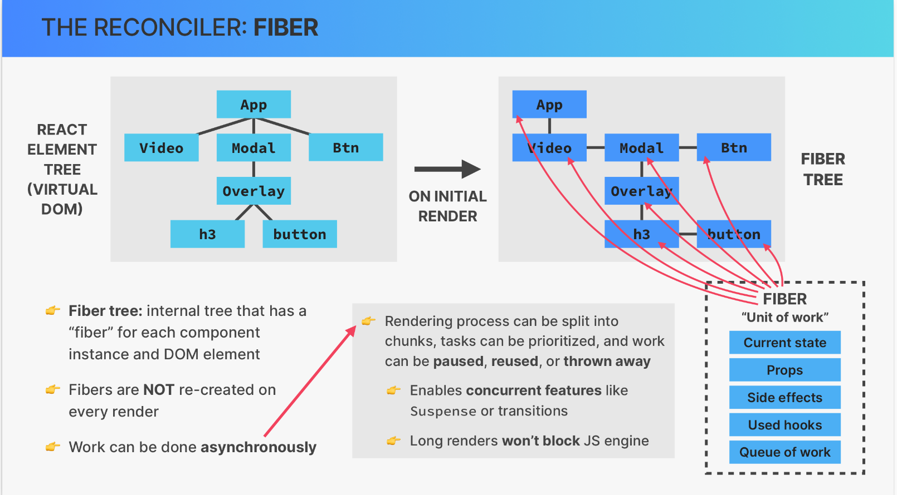
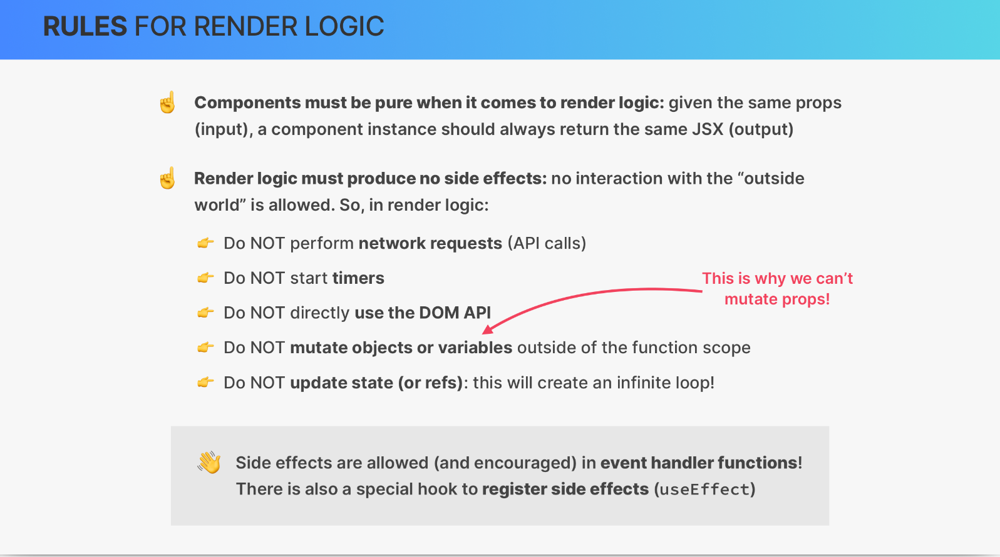
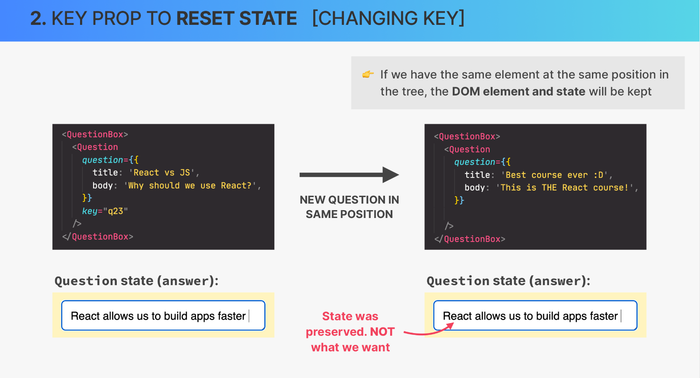

## ReactJS

- [What is React](#1)
- [Components](#2)
- [JSX](#3)
- [Props](#4)
  - [Rendering List](#5)
  - [Conditional Rendering With &&](#6)
  - [Conditional Rendering With Ternaries](#7)
  - [Conditional Rendering With Multiple Returns](#8)
- [State](#9)
  - [useState examples with buttons](#10)
  - [useState examples with form and selector](#11)
  - [useState examples with delete item and clear list](#12)
  - [useState example with checkbox](#13)
  - [useState example with sorting items](#14)
  - [useState example with open/close button](#20)
- [State management](#15)
  - [useState example with derived state ](#16)
- [Children prop](#17)
- [Split a UI into components](#18)
- [Component composition](#19)
- [Styling variants](#21)
- [Props as a Component API. PropTypes.](#22)
- [Components, Instances, and Elements](#23)
- [Rendering](#24)
- [Key Prop](#25)
- [State Batching](#26)
- [Events](#27)
  - [Practical implication](#28)
- [Effects and Data Fetching](#29)

---

### What is React <a name="1"></a>

`React` – extremely popular declarative, component-based, state-driven JavaScript library for building user interfaces, created by Facebook.

- Based on components. Components are the building blocks of user interfaces in React. We build complex UIs by building and combining multiple components.
- Declarative. We describe how components look like and how they work using a declarative syntax called JSX. `JSX` a syntax that combines HTML, CSS, JavaScript, as well as referencing other components.
- State-driven. React reacts to state changes by re-rendering the UI.

There are several options and freamworks to work with React (Vite, Next.js, Remix, etc.)


---

### Components <a name="2"></a>

React applications are entirely made out of components. We build complex UIs by building multiple components and combining them. Components can be reused, nested inside each other, and pass data between them.


---

### JSX <a name="3"></a>

Components must return a block of JSX. `Extension of JavaScript` that allows us to
embed JavaScript, CSS, and React components into HTML. Each JSX element is converted to a `React.createElement` function call.


---

### Props <a name="4"></a>

`Props` like a chain or communication chanel between a parent and a child components. Props are used to pass data from parent components to child components (down the component tree). With props, parent components control how child components look and work. This one-way date flow makes applications more predictable and easier to understand, easier to debug. Anything can be passed as props: single value, arrays, objects, functions, even other components.
So, props is data coming from the outside, and can only be updated by the parent component. Props are read-only, they are immutable! This is one of React’s strict rules. If you need to mutate props, you actually need state.

---

#### 🚩 Rendering List <a name="5"></a>

For rendering usualy used `.map` which allows to loop through array and create a brand new array.

Example - [Udemy-pizza-menu](https://github.com/agpavlik/Udemy-pizza-menu)

```javascript
const pizzaData = [
  {
    name: "Focaccia",
    ingredients: "Bread with italian olive oil and rosemary",
    price: 6,
    photoName: "pizzas/focaccia.jpg",
    soldOut: false,
  },
  {
    name: "Pizza Margherita",
    ingredients: "Tomato and mozarella",
    price: 10,
    photoName: "pizzas/margherita.jpg",
    soldOut: false,
  },
  {
    name: "Pizza Spinaci",
    ingredients: "Tomato, mozarella, spinach, and ricotta cheese",
    price: 12,
    photoName: "pizzas/spinaci.jpg",
    soldOut: true,
  },
];

function Menu() {
  const pizzas = pizzaData;
  const numPizzas = pizzas.length;

  return (
    <main className="menu">
      <h2>Our menu</h2>
      <ul className="pizzas">
        {pizzaData.map((pizza) => (
          <Pizza pizzaObj={pizza} key={pizza.name} />
        ))}
      </ul>
    </main>
  );
}

function Pizza(props) {
  return (
    <li className={`pizza ${props.pizzaObj.soldOut ? "sold-out" : ""}`}>
      
      <div>
        <h3>{props.pizzaObj.name}</h3>
        <p>{props.pizzaObj.ingredients}</p>

        <span>
          {props.pizzaObj.soldOut ? "SOLD OUT" : props.pizzaObj.price}
        </span>
      </div>
    </li>
  );
}
```

---

#### 🚩 Conditional Rendering With && <a name="6"></a>

```javascript
function Footer() {
  const hour = new Date().getHours();
  const openHour = 12;
  const closeHour = 22;
  const isOpen = hour >= openHour && hour <= closeHour;

  return (
    <footer className="footer">
      {isOpen && (
        <div className="order">
          <p>
            We're open from {props.openHour}:00 to {props.closeHour}:00. Come
            visit us or order online
          </p>
          <button className="btn">Order</button>
        </div>
      )}
    </footer>
  );
}
```

---

#### 🚩 Conditional Rendering With Ternaries <a name="7"></a>

```javascript
function Footer() {
  const hour = new Date().getHours();
  const openHour = 12;
  const closeHour = 22;
  const isOpen = hour >= openHour && hour <= closeHour;

  return (
    <footer className="footer">
      {isOpen ? (
        <div className="order">
          <p>
            We're open from {props.openHour}:00 to {props.closeHour}:00. Come
            visit us or order online
          </p>
          <button className="btn">Order</button>
        </div>
      ) : (
        <p>
          We're happy welcome you between {openHour}:00 and {closeHour}:00.
        </p>
      )}
    </footer>
  );
}
```

Also, ternary operator can be used to conditionaly set some style.<br>
Example: `<span style={item.packed ? {textDecoration:"line-trough"}: {} }>`

---

#### 🚩 Conditional Rendering With Multiple Returns <a name="8"></a>

```javascript
function Footer() {
  const hour = new Date().getHours();
  const openHour = 12;
  const closeHour = 22;
  const isOpen = hour >= openHour && hour <= closeHour;

  if (!isOpen) {
    return (
      <footer className="footer">
        <p>CLOSED</p>
      </footer>
    );
  }

  return (
    <footer className="footer">
      {isOpen ? (
        <div className="order">
          <p>
            We're open from {props.openHour}:00 to {props.closeHour}:00. Come
            visit us or order online
          </p>
          <button className="btn">Order</button>
        </div>
      ) : (
        <p>
          We're happy welcome you between {openHour}:00 and {closeHour}:00.
        </p>
      )}
    </footer>
  );
}
```

---

### State <a name="9"></a>

`State` is the most important concept in React. `State` is a “component’s memory”.
`State` is internal data that can be updated by the components logic. Data that a component can hold over time, necessary for information that it needs to remember throughout the app’s lifecycle. Updating component state triggers React to re-render the component.
In React, a view is updated by re-rendering the component.

Practical guideline about state:

- Each component has and manages its own state, no matter how many times we render the same component;
- Use a state variable for any data that the component should keep track of ("remember") over time. This is data that will change at some point.
- Whenever you want something in the component to be dynamic,create a piece of state related to that “thing”, and update the state when the “thing” should change.<br>
  Example: A modal window can be open or closed. So we create a state variable 'isOpen' that tracks whether the modal is open or not. On 'isOpen = true' we display the window, on 'isOpen = false' we hide it.
- If you want to change the way a component looks, or the data it displays, update its state. This usually happens in an event handler function.
- When building a component, imagine its view as a reflection of state changing over time.
- For data that should not trigger component re-render, don’t use state. Use a regular variable instead.


`useState` implementation:

- add new state variable
- use state variable in the code
- update piace of state in some event handler function

`Updating State Based on Current State`: Callback function is used to update state based on the current value of this state.

---

#### 🚩 useState examples with button <a name="10"></a>

Example - [Udemy-step](https://github.com/agpavlik/Udemy-step)

```javascript
import { useState } from "react"; // import useState function from react

const messages = [
  "Learn React ⚛️",
  "Apply for jobs 💼",
  "Invest your new income 🤑",
];

export default function App() {
  const [step, setStep] = useState(1); // add new state variable
  const [isOpen, setIsOpen] = useState(true);

  function handlePrevious() {
    if (step > 1) setStep((s) => s - 1); //update piace of state in event handler function. Callback function is used to update state based on the current value of this state
  }
  function handleNext() {
    if (step < 3) setStep(step + 1); //update piace of state in event handler function
  }

  return (
    <>
      <button
        className="close"
        onClick={() => setIsOpen(!isOpen)} // function created in-line instead of creating handle function out
      >
        &times;
      </button>
      {isOpen && (
        <div className="steps">
          <div className="numbers">
            <div className={step >= 1 ? "active" : ""}>1</div>
            <div className={step >= 2 ? "active" : ""}>2</div>
            <div className={step >= 3 ? "active" : ""}>3</div>
          </div>
          <p className="message">
            Step {step}: {messages[step - 1]}
          </p>
          <div className="buttons">
            <button
              style={{ backgroundColor: "#7950f2", color: "#fff" }}
              onClick={handlePrevious} // event handler
            >
              Previous
            </button>
            <button
              style={{ backgroundColor: "#7950f2", color: "#fff" }}
              onClick={handleNext} // event handler
            >
              Next
            </button>
          </div>
        </div>
      )}
    </>
  );
}
```

Example - [Udemy-flashcards](https://github.com/agpavlik/Udemy-flashcards)

```javascript
const questions = [
  {
    id: 3457,
    question: "What language is React based on?",
    answer: "JavaScript",
  },
  {
    id: 7336,
    question: "What are the building blocks of React apps?",
    answer: "Components",
  },
];

function FlashCards() {
  const [selectedId, setSelectedId] = useState(null);

  function handleClick(id) {
    setSelectedId(id !== selectedId ? id : null);
  }

  return (
    <div className="flashcards">
      {questions.map((question) => (
        <div
          key={question.id}
          onClick={() => handleClick(question.id)}
          className={question.id === selectedId ? "selected" : ""}
        >
          <p>
            {question.id === selectedId ? question.answer : question.question}
          </p>
        </div>
      ))}
    </div>
  );
}
```

---

#### 🚩 useState examples with form and selector <a name="11"></a>

Example - [Udemy-far-away](https://github.com/agpavlik/Udemy-far-away)

```javascript
import { useState } from "react";

export default function Form() {
  const [description, setDescription] = useState("");
  const [quantity, setQuantity] = useState(1);
  const [items, setItems] = useState([]);

  function handleAddItems(item) {
    setItems((items) => [...items, item]); //add a new item into existing array
  }

  function handleSubmit(e) {
    e.preventDefault(); // Page not to reload. thia disavbled its default behaviour of HTML.
    if (!description) return; // we should been able to submit the form without description

    const newItem = {
      description,
      quantity,
      packed: false,
      id: Date.now(),
    };

    handleAddItems(newItem);

    setDescription(""); //after submition form should back to the initial state
    setQuantity(1); //after submition form should back to the initial state
  }

  // Trick for selector. Create an empty array with 20 elements. Than pass a function with two elements (value and index) and will receive an array with numbers from 1 to 20. Than loop with map method over this array to create a list of elements.

  // e.target.value is always a string, therefore we use Number to convert it to number.
  return (
    <form className="add-form" onSubmit={handleSubmit}>
      <h3>What do you need for your trip?</h3>
      <select
        value={quantity}
        onChange={(e) => setQuantity(Number(e.target.value))}
      >
        {Array.from({ length: 20 }, (_, i) => i + 1).map((num) => (
          <option value={num} key={num}>
            {num}
          </option>
        ))}
      </select>
      <input
        type="text"
        placeholder="Item..."
        value={description}
        onChange={(e) => setDescription(e.target.value)}
      />

      <button>Add</button>
    </form>
  );
}
```

Example - [Udemy-eat-n-split](https://github.com/agpavlik/Udemy-eat-n-split)

```javascript
export default function App() {
  const [friends, setFriends] = useState(initialFriends);

  function handleAddFriend(friend) {
    setFriends((friends) => [...friends, friend]);
    setShowAddFriend(false);
  }

  return (
    <div className="app">
      <FormAddFriend onAddFriend={handleAddFriend} />
    </div>
  );
}

function FormAddFriend({ onAddFriend }) {
  const [name, setName] = useState("");
  const [image, setImage] = useState("https://i.pravatar.cc/48");

  function handleSubmit(e) {
    e.preventDefault();

    if (!name || !image) return;

    const id = crypto.randomUUID();
    const newFriend = { name, image: `${image}?=${id}`, balance: 0, id };
    onAddFriend(newFriend);

    setName("");
    setImage("https://i.pravatar.cc/48");
  }

  return (
    <form className="form-add-friend" onSubmit={handleSubmit}>
      <label> Friend name </label>
      <input
        type="text"
        value={name}
        onChange={(e) => setName(e.target.value)}
      />

      <label> Image URL </label>
      <input
        type="text"
        value={image}
        onChange={(e) => setImage(e.target.value)}
      />

      <Button>Add</Button>
    </form>
  );
}
```

Example - [Udemy-tip-calculator](https://github.com/agpavlik/Udemy-tip-calculator) - input

```javascript
export default function TipCalculator() {
  const [bill, setBill] = useState("");

  return (
    <div>
      <BillInput bill={bill} onSetBill={setBill} />
    </div>
  );
}

function BillInput({ bill, onSetBill }) {
  return (
    <div className="question">
      <label> How much was the bill ?</label>
      <input
        className="input"
        type="text"
        placeholder="Bill value"
        value={bill}
        onChange={(e) => onSetBill(Number(e.target.value))}
      ></input>
    </div>
  );
}
```

Example - [Udemy-tip-calculator](https://github.com/agpavlik/Udemy-tip-calculator) - select

```javascript
export default function TipCalculator() {
  const [bill, setBill] = useState("");
  const [percentage1, setPercentage1] = useState(0);
  const [percentage2, setPercentage2] = useState(0);

  const tip = bill * ((percentage1 + percentage2) / 2 / 100);

  function handleReset() {
    setBill("");
    setPercentage1(0);
    setPercentage2(0);
  }

  return (
    <div>
      <BillInput bill={bill} onSetBill={setBill} />
      <SelectPercentage percentage={percentage1} onSelect={setPercentage1}>
        How did you like the service?
      </SelectPercentage>
      <SelectPercentage percentage={percentage2} onSelect={setPercentage2}>
        How did your friend like the service?
      </SelectPercentage>
    </div>
  );
}

function SelectPercentage({ children, onSelect, percentage }) {
  return (
    <div className="question">
      <label>{children}</label>
      <select
        className="input"
        value={percentage}
        onChange={(e) => onSelect(Number(e.target.value))}
      >
        <option value="0">Dissatisfied (0%) </option>
        <option value="5">It was okay (5%)</option>
        <option value="10">It was good (10%)</option>
        <option value="20">Abssolutely amazing! (20%)</option>
      </select>
    </div>
  );
}
```

---

#### 🚩 useState examples with delete item and clear list<a name="12"></a>

Example - [Udemy-far-away](https://github.com/agpavlik/Udemy-far-away)

```javascript
export default function App() {
  const [items, setItems] = useState([]);

  function handleDeleteItem(id) {
    setItems((items) => items.filter((item) => item.id !== id)); // delete item with the exact id. Filter create a new array without the exact id.
  }

  function handleClearList() {
    const confirmed = window.confirm(
      "Are you sure you want to delete all items?"
    );
    if (confirmed) setItems([]);
  }

  return (
    <div>
      <PackingList
        items={items}
        onDeleteItem={handleDeleteItem}
        onClearList={handleClearList}
      />
    </div>
  );
}

function PackingList({ items, onDeleteItem, onClearList }) {
  return (
    <div className="list">
      <ul>
        {items.map((item) => (
          <Item item={item} key={item.id} onDeleteItem={onDeleteItem} />
        ))}
      </ul>
      <button onClick={onClearList}>Clear list</button>
    </div>
  );
}

// Create a function in onClick in order to receive just an item.id, but not a whole event
function Item({ item, onDeleteItem }) {
  return (
    <li>
      <span style={item.packed ? { textDecoration: "line-through" } : {}}>
        {item.quantity} {item.description}
      </span>
      <button onClick={() => onDeleteItem(item.id)}>❌</button>
    </li>
  );
}
```

Example - [Udemy-tip-calculator](https://github.com/agpavlik/Udemy-tip-calculator) - reset

```javascript
export default function TipCalculator() {
  const [bill, setBill] = useState("");

  function handleReset() {
    setBill("");
    setPercentage1(0);
    setPercentage2(0);
  }

  return (
    <div>
      <BillInput bill={bill} onSetBill={setBill} />
      {bill > 0 && (
        <>
          <Output bill={bill} tip={tip} />
          <Reset onReset={handleReset} />
        </>
      )}
    </div>
  );
}

function Reset({ onReset }) {
  return (
    <button className="btn" onClick={onReset}>
      Reset
    </button>
  );
}
```

---

#### 🚩 useState examples with checkbox <a name="13"></a>

Example - [Udemy-far-away](https://github.com/agpavlik/Udemy-far-away)

```javascript
export default function App() {
  const [items, setItems] = useState([]);

  function handleToggleItem(id) {
    setItems((items) =>
      items.map((item) =>
        item.id === id ? { ...item, packed: !item.packed } : item
      )
    ); // return the same array but with one object updated
  }

  return (
    <div>
      <PackingList items={items} onToggleItem={handleToggleItem} />
    </div>
  );
}

function PackingList({ items, onToggleItem }) {
  return (
    <div className="list">
      <ul>
        {items.map((item) => (
          <Item item={item} key={item.id} onToggleItem={onToggleItem} />
        ))}
      </ul>
    </div>
  );
}

// Create a function in onChange in order to change just one item, but not a whole event
function Item({ item, onToggleItem }) {
  return (
    <li>
      <input
        type="checkbox"
        value={item.packed}
        onChange={() => onToggleItem(item.id)}
      />
      <span style={item.packed ? { textDecoration: "line-through" } : {}}>
        {item.quantity} {item.description}
      </span>
    </li>
  );
}
```

---

#### 🚩 useState examples with sorting items <a name="14"></a>

Example - [Udemy-far-away](https://github.com/agpavlik/Udemy-far-away)

```javascript
export default function PackingList({ items }) {
  const [sortBy, setSortBy] = useState("input"); // by default will be the first value

  let sortedItems;

  if (sortBy === "input") sortedItems = items;
  if (sortBy === "description")
    sortedItems = items
      .slice() //a copy of an array
      .sort((a, b) => a.description.localeCompare(b.description));
  if (sortBy === "packed")
    sortedItems = items
      .slice()
      .sort((a, b) => Number(a.packed) - Number(b.packed));

  return (
    <div className="list">
      <ul>
        {sortedItems.map((item) => (
          <Item item={item} key={item.id} />
        ))}
      </ul>

      <div className="actions">
        <select value={sortBy} onChange={(e) => setSortBy(e.target.value)}>
          <option value="input">Sorts by input order</option>
          <option value="description">Sort by description</option>
          <option value="packed">Sort by packed status</option>
        </select>
      </div>
    </div>
  );
}
```

---

#### useState example with open/close button <a name="20"></a>

Example - [Udemy-use-popcorn](https://github.com/agpavlik/Udemy-use-popcorn)

```javascript
function Box({ children }) {
  const [isOpen, setIsOpen] = useState(true);

  return (
    <div className="box">
      <button className="btn-toggle" onClick={() => setIsOpen((open) => !open)}>
        {isOpen ? "–" : "+"}
      </button>
      {isOpen && children}
    </div>
  );
}
```

---

### State Management <a name="15"></a>

`State management`: Deciding when to create pieces of state, what types of state are necessary, where to place each piece of state, and how data flows trough app.


`One-way data flow`: Means that data can only be passed from parents to children and never in opposite way. Also, data cannot flow sideways to siblings.

`Lifting state up`: In order to share one piece of state with siblings it should be lifted up to the closest common parent.

`Inverse data flow`: child-to-parent communication when child updating parent state.


`Derived State`: state that is computed from an existing piece of state or form props.


---

#### 🚩 useState examples with derived state <a name="16"></a>

Example - [Udemy-far-away](https://github.com/agpavlik/Udemy-far-away)

```javascript
export default function Stats({ items }) {
  const [items, setItems] = useState([]);

  if (!items.length)
    return (
      <p className="stats">
        <em>Start adding some items to your packing list </em>
      </p>
    );
  const numItems = items.length;
  const numPacked = items.filter((item) => item.packed).length;
  const percentage = Math.round((numPacked / numItems) * 100);

  return (
    <footer className="stats">
      <em>
        {percentage === 100
          ? "You got everything! Ready to go ✈️"
          : `You have ${numItems} items on your list, and you have already packed
        ${numPacked} (${percentage}%)`}
      </em>
    </footer>
  );
}
```

---

### Children prop <a name="17"></a>

When we include the button component in some JSX, instead of immediately closing the element, we can write some more JSX into that element. We can write anything that we want between the opening and the closing tag of the component that we are using.

Example - [Udemy-step](https://github.com/agpavlik/Udemy-step)

```javascript
import { useState } from "react";

const messages = [
  "Learn React ⚛️",
  "Apply for jobs 💼",
  "Invest your new income 🤑",
];

export default function App() {
  const [step, setStep] = useState(1);
  const [isOpen, setIsOpen] = useState(true);

  function handlePrevious() {
    if (step > 1) setStep((s) => s - 1);
  }
  function handleNext() {
    if (step < 3) setStep(step + 1);
  }

  return (
    <>
      <button className="close" onClick={() => setIsOpen(!isOpen)}>
        &times;
      </button>
      {isOpen && (
        <div className="steps">
          <div className="numbers">
            <div className={step >= 1 ? "active" : ""}>1</div>
            <div className={step >= 2 ? "active" : ""}>2</div>
            <div className={step >= 3 ? "active" : ""}>3</div>
          </div>

          <StepMessage step={step}>
            {messages[step - 1]}
            <div className="buttons">
              <Button
                bgColor="#c7c7c7"
                textColor="#333"
                onClick={() => alert(`Learn how to ${messages[step - 1]}`)}
              >
                Lern how
              </Button>
            </div>
          </StepMessage>

          <div className="buttons">
            <Button bgColor="#7950f2" textColor="#fff" onClick={handlePrevious}>
              <span>👈</span> Previous
            </Button>
            <Button bgColor="#7950f2" textColor="#fff" onClick={handleNext}>
              Next <span>👉</span>
            </Button>
          </div>
        </div>
      )}
    </>
  );
}

function StepMessage({ step, children }) {
  return (
    <div className="message">
      <h3>Step {step}</h3>
      {children}
    </div>
  );
}

function Button({ textColor, bgColor, onClick, children }) {
  return (
    <button
      style={{ backgroundColor: bgColor, color: textColor }}
      onClick={onClick}
    >
      {children}
    </button>
  );
}
```

---

### Split a UI into components<a name="18"></a>


---

### Component composition<a name="19"></a>

`Component composition`: combining different components using the
children prop (or explicitly defined props)
We use composition for two reasons:

1. Create highly reusable and flexible components
2. Fix prop drilling (great for layouts)


Example - [Udemy-use-popcorn](https://github.com/agpavlik/Udemy-use-popcorn)

Examle with using the children:

```javascript
// before
export default function App() {
  const { movies, setMovies} = useState(tempMovieData);

  return (
    <>
      <NavBar movies={movies} />
      <Main movies={movies} />
  )
}

function NavBar({ movies }) {
  return <nav className="nav-bar">
    <Logo />
    <Search />
    <NumResults movies={movies}>
  </nav>;
}
```

```javascript
// after using component composition
// prop drilling has been eliminated
export default function App() {
  const { movies, setMovies} = useState(tempMovieData);

  return (
    <>
      <NavBar>
        <Logo />
        <Search />
        <NumResults movies={movies}>
      </NavBar>
      <Main movies={movies} />
  )
}

function NavBar({ children }) {
  return <nav className="nav-bar">{children}</nav>;
}
```

Example with using the explicit prop

```javascript
// before
export default function App() {
  return (
    <Main>
      <Box>
        <MovieList movies={movies} />
      </Box>
    </Main>
  );
}

function Box({ children }) {}
```

```javascript
// after using the explicit prop
export default function App() {
  return (
    <Main>
      <Box element={<MovieList movies={movies} />} />
    </Main>
  );
}

function Box({ element }) {} // can be called anything
```

---

### Styling variants <a name="21"></a>

Variant 1

```javascript
function Header() {
  return (
    <h1
      style={{ color: "red", fontSize: "48px", tetxTransform: "uppercase" }}
    />
  );
}
```

Variant 2

```javascript
function Header() {
  const style = { color: "red", fontSize: "48px", tetxTransform: "uppercase" };
  return <h1 style={style} />;
}
```

---

### Props as a Component API. PropTypes.<a name="22"></a>

Example - [Udemy-use-popcorn](https://github.com/agpavlik/Udemy-use-popcorn)

```javascript
//provide default values for props
export default function StarRating({
  maxRating = 5,
  color = "#c69603",
  size = 34,
  className = "",
  messages = [],
  defaultRating = 0,
  onSetRating,
}) {
  const textStyle = {
    lineHeight: "1",
    margin: "0",
    color: color,
    size: `${size}px`,
  };

  return (
    <div>
      <div>
        {Array.from({ length: maxRating }, (_, i) => (
          <Star color={color} size={size} />
        ))}
      </div>

      <p style={textStyle}>
        {messages.length === maxRating ? "text 1" : "text 2"}
      </p>
    </div>
  );
}
```

With proptypes, we can specify the type of value that we expect the consumer of the component to pass in for each of the props. This days developers don't really do this anymore.
First of all, import PropTypes object from proptypes package.

```javascript
import PropTypes from "prop-types";

//type property name with lowercase 'p'
StarRating.propTypes = {
  maxRating: PropTypes.number,
  color: PropTypes.string,
  size: PropTypes.number,
  messages: PropTypes.array,
  className: PropTypes.string,
  onSetRating: PropTypes.func,
  defaultRating: PropTypes.number,
};

export default function StarRating({
  maxRating = 5,
  color = "#c69603",
  size = 34,
  className = "",
  messages = [],
  defaultRating = 0,
  onSetRating,
}) {return()}
```

---

### Components, Instances, and Elements<a name="23"></a>

Components are what we write in order to describe a piece of the user interface. And the component is just a regular JavaScript function, but it's a function that returns React elements. And we usually write these elements using the JSX syntax.
So we can essentially think of a component as a blueprint or a template, that React then creates one or multiple component instances. So we can say that an instance is like the actual physical manifestation of a component living in our componentry.
Now in practice, we many times just use the terms component and component instance interchangeably.
React executes the code in each of these instances, each of them will return one or more React elements. A React element basically contains all the information that is necessary in order to create DOM elements.
DOM Element (HTML) is a visual representation of the component instance in the browser.


---

### Rendering<a name="24"></a>


`Reconciliation` is basically deciding exactly which DOM elements need to be inserted, deleted or updated in order to reflect the latest state changes. So the result of the reconciliation process is gonna be a list of DOM operations that are necessary to update the current DOM with a new state. Reconciliation is processed by a reconciler and we can say that the reconciler really is the engine of React. It's like the heart of React. The current reconciler in React is called `Fiber`. Fiber takes the entire React element tree (the virtual DOM), and based on it builds another tree which is the Fiber tree. The Fiber tree is a special internal tree where for each component instance and DOM element in the app, there is one so-called Fiber. What's special about this tree is that unlike React elements in the virtual DOM, Fibers are not recreated on every render. So, the Fiber tree is never destroyed. Instead, it's a mutable data structure and once it has been created during the initial render, it's simply mutated over and over again in future reconciliation steps. And this makes Fibers the perfect place for keeping track of things like the current component state, props, side effects, list of used hooks and more.

`Virtual DOM` : Tree of all React elements created from all instances in the component tree.





---

### Key Prop<a name="25"></a>





---

### State Batching<a name="26"></a>


How these three pieces of state are actually updated behind the scenes? So we might think that, as React sees the set answer function call, it would update the state to the empty string as requested, and then trigger a re-render, and the commit phase,then it would move on to the next line, and to the same thing again,and finally do the entire thing one more time for the third state update. Intuitively, we would think that, if there are three state variables being updated in this event handler,then React would re-render three times. However, this is not how React updates multiple pieces of state in the same event handler function. Instead, these state updates will actually get batched into just one state update for the entire event handler. So updating multiple pieces of state won't immediately cause a re-render for each update. Instead, all pieces of state inside the event handler are updated in one go. They are batched, and only then React will trigger one single render and commit.
And conceptually, it makes sense that React works this way,because if we're updating these pieces of state together, it probably means that they should just represent one new view, and therefore, React only updates the screen once.
If these date updates belong together, it really wouldn't make much sense to update the screen three times.


---

### Events<a name="27"></a>


Let's say that some event happens, like a click on one of the three buttons. As soon as the event fires, a new event object will be created, but it will not be created where the click
actually happened. Instead, the object will be created at the root of the document, so at the very top of the tree. From there, the event will then travel down the entire tree during the so-called `capturing phase`, until it reaches the target element, on which the event was actually first triggered. Then immediately after the target element has been reached, the event object travels all the way back up the entire tree during the so-called `bubbling phase`.


---

### Practical implication <a name="28"></a>


---

### Effects and Data Fetching<a name="29"></a>

If we use JS fetch function it will run an infinite number of requests, and it never really stops. So every second our app is firing off multiple fetch requests to the API, which of course is a really bad idea. The reason is that setting the state here in the render logic will then immediately cause the component to re-render itself again. However, as the component is re-rendered, the function here of course is executed again, which then will fetch again, which in turn will set the movies again as well. And then this whole thing starts over and over again.
And so this is the reason why it is really not allowed to set state in render logic.

```javascript
export default function App() {
  const [movies, setMovies] = useState([]);

  fetch(`http://...`)
    .then((res) => res.json())
    .then((data) => setMovies(data.Search));
}
```

The idea of the `useEffect` hook is to give us a place where we can safely write side effects like afforemention. Side effects registered with the useEffect hook will only be executed after certain renders. For example, only write after the initial render.

```javascript
export default function App() {
  const [movies, setMovies] = useState([]);

  useEffect(function () {
    fetch(`http://...`)
      .then((res) => res.json())
      .then((data) => setMovies(data.Search));
  }, []);
}
```

So we used the useEffect hook to register an effect. Register means that we want this code here not to run as the component renders, but actually after it has been painted onto the screen.


Many times when we need a lot of code to handle a promise, it's a lot easier and nicer to just have an async function.

```javascript
export default function App() {
  const [movies, setMovies] = useState([]);

  useEffect(function () {
    async function fetchMovies(){
      const res = await fetch(`http://...`)
      const data = await res.json())
      setMovies(data.Search)
    }
    fetchMovies();
  }, []);
}
```

```javascript
// Add Loading indicator and error handling
export default function App() {
  const [movies, setMovies] = useState([]);
  const [isLoading, setIsLoading]=useState(false)
  const [error, setError] = useState('')

  useEffect(function () {
    async function fetchMovies(){
      try {setIsLoading(true);
        const res = await fetch(`http://...`)

        if (!res.ok) throw new Error("Something went wrong with fetching movies")

        const data = await res.json())

        if (data.Responce === 'False') trow new Error ("Movie not found")

        setMovies(data.Search)

      } catch (err){
        console.error(err.message)
        setError(error.message)
      } finally {
        setLoading(false)
      }
    }
    fetchMovies();
  }, []);
}
```


