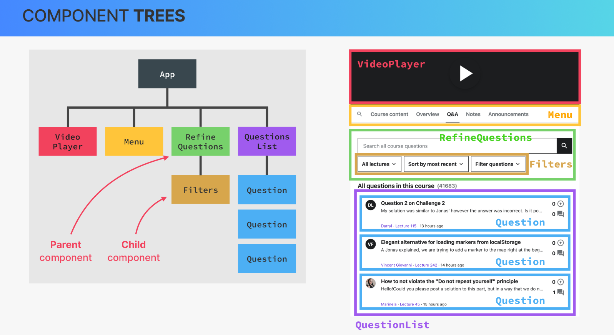
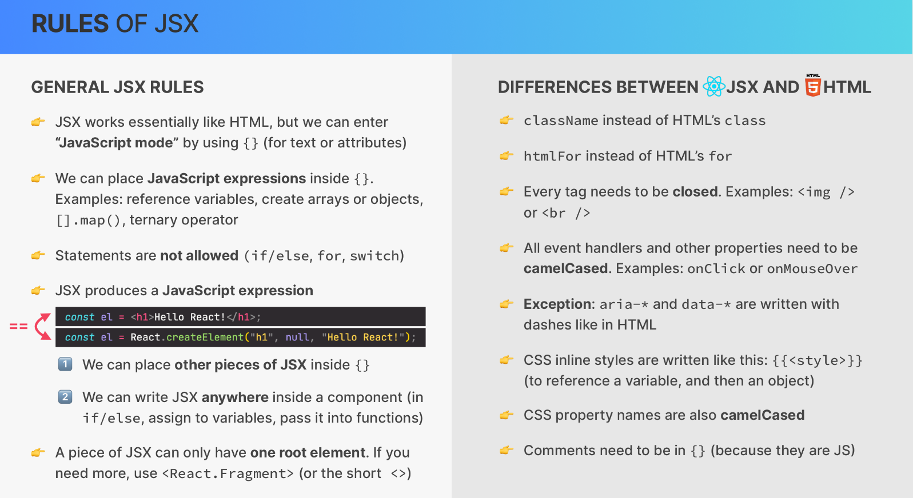

# React

## What is React

`React` – extremely popular declarative, component-based, state-driven JavaScript library for building user interfaces, created by Facebook.

- Based on components. Components are the building blocks of user interfaces in React. We build complex UIs by building and combining multiple components.
- Declarative. We describe how components look like and how they work using a declarative syntax called JSX. `JSX` a syntax that combines HTML, CSS, JavaScript, as well as referencing other components.
- State-driven. React reacts to state changes by re-rendering the UI.

There are several options and freamworks to work with React (Vite, Next.js, Remix, etc.)

## Components

React applications are entirely made out of components. We build complex UIs by building multiple components and combining them. Components can be reused, nested inside each other, and pass data between them.

## JSX

Components must return a block of JSX. `Extension of JavaScript` that allows us to
embed JavaScript, CSS, and React components into HTML. Each JSX element is converted to a `React.createElement` function call.

## Props

`Props` like a chain or communication chanel between a parent and a child components. Props are used to pass data from parent components to child components (down the component tree). With props, parent components control how child components look and work. This one-way date flow makes applications more predictable and easier to understand, easier to debug. Anything can be passed as props: single value, arrays, objects, functions, even other components.
So, props is data coming from the outside, and can only be updated by the parent component. Props are read-only, they are immutable! This is one of React’s strict rules. If you need to mutate props, you actually need state.
